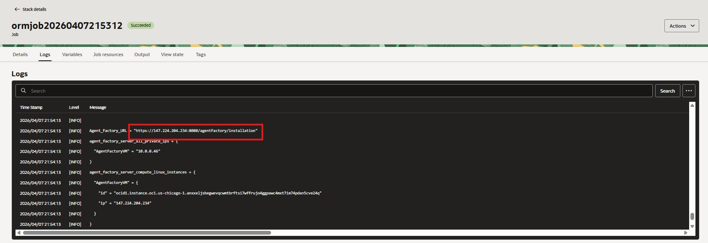
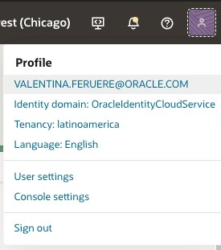
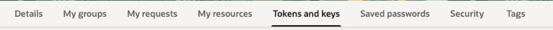
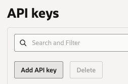
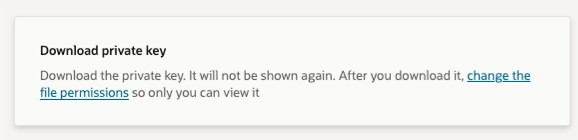

<div align="center">


# 🚀 DeepDive Workshop OCI 2026
### AI Data Platform (AIDP) + AI Database Agent Factory

[](https://cloud.oracle.com/)
[](https://www.oracle.com/database/)
[](https://www.oracle.com/artificial-intelligence/generative-ai/)
[](https://www.oracle.com/ai-data-platform/)
[]()

*Un workshop end‑to‑end para construir una plataforma de datos moderna e inteligente sobre Oracle Cloud Infrastructure, integrando **AI Data Platform** y **AI Database Private Agent Factory**.*

</div>

---

## 📖 Acerca de este workshop

En este laboratorio vas a recorrer el ciclo completo de una **plataforma de datos con IA generativa** sobre Oracle Cloud Infrastructure. Aprovisionarás los servicios, ingestarás datos, organizarás catálogos en arquitectura medallón (Bronze/Silver/Gold) y, finalmente, construirás **agentes de IA** capaces de entender lenguaje natural, generar SQL y narrar resultados — todo sobre productos nativos de Oracle.

Trabajaremos con dos productos estrella del stack de IA de Oracle:

| Producto | Descripción |
|---|---|
| 🧩 **Oracle AI Data Platform (AIDP)** | Plataforma unificada para ingesta, catalogación, workflows de datos, notebooks y agentes inteligentes. |
| 🤖 **Oracle AI Database Private Agent Factory (DPAF)** | Factoría de agentes privados desplegada en tu tenancy, con Agent Builder visual, RAG y Text‑to‑SQL sobre Oracle Database 26ai. |

> 💡 **Pre‑requisito:** acceso activo a una consola de **Oracle Cloud Infrastructure** con permisos en el compartment donde se desplegarán los servicios.

---

## 🎯 Objetivos de aprendizaje

Al finalizar, serás capaz de:

- Aprovisionar una **Autonomous AI Database 26ai** y una instancia de **AI Data Platform** desde cero.
- Ingestar datos en Autonomous mediante `DBMS_CLOUD` y en AIDP mediante catálogos externos y estándar.
- Organizar información siguiendo la arquitectura medallón (**Bronze → Silver → Gold**).
- Ejecutar notebooks de laboratorio en un **cluster de AIDP**.
- Desplegar **AI Database Private Agent Factory** desde OCI Marketplace.
- Construir un **Data Analysis Agent** para Text‑to‑SQL sin escribir código.
- Diseñar un flujo conversacional en **Agent Builder** conectado a una base de datos real.

---

## 🗺️ Arquitectura de la solución

```
                         ┌──────────────────────────┐
                         │   Oracle Cloud Console   │
                         │           (OCI)          │
                         └────────────┬─────────────┘
                                      │ aprovisiona
                                      ▼
                     ┌───────────────────────────────┐
                     │   Autonomous AI Database 26ai │
                     │    (fuente de datos común)    │
                     └──────┬─────────────────┬──────┘
                   Wallet   │                 │   Wallet
                ┌───────────┘                 └────────────┐
                ▼                                           ▼
 ┌──────────────────────────────┐           ┌──────────────────────────────────┐
 │  AI Data Platform (AIDP)     │           │           VCN (Módulo 3)         │
 │  • Catálogos Bronze/Silver/  │           │  Security List / NSG             │
 │    Gold                      │           │  • Ingress TCP 8080              │
 │  • Workspace · Notebooks     │           │    (desde IP autorizada)         │
 │  • Workflows                 │           │            │                      │
 └──────────────────────────────┘           │            ▼                      │
         Módulos 1 y 2                      │  AI Database Private Agent        │
                                            │  Factory (DPAF)                   │
                                            │  • Data Source                    │
                                            │  • Data Analysis Agents           │
                                            │  • Agent Builder · Text-to-SQL    │
                                            └──────────────────────────────────┘

         ※ AIDP y DPAF operan de forma independiente. Ambos consumen la misma
           Autonomous AI Database; DPAF requiere VCN con puerto TCP 8080 abierto.
```

---

## 🧭 Tabla de contenidos

### 🧱 Módulo 1 · Preparación del entorno
- [1.1 Creación del compartment `demo`](#11-creación-del-compartment-demo)
- [1.2 Creación de la Autonomous AI Database](#12-creación-de-la-autonomous-ai-database)
- [1.3 Descarga de la Wallet](#13-descarga-de-la-wallet)
- [1.4 Creación de la AI Data Platform](#14-creación-de-la-ai-data-platform)

### 📥 Módulo 2 · Ingesta y catalogación de datos
- [2.1 Ingesta en Autonomous AI Database](#21-ingesta-en-autonomous-ai-database)
- [2.2 Ingesta vía AIDP](#22-ingesta-vía-aidp)
- [2.3 Creación de catálogos (Bronze / Silver / Gold)](#23-creación-de-catálogos-bronze--silver--gold)
- [2.4 Importación de notebooks al workspace](#24-importación-de-notebooks-al-workspace)
- [2.5 Creación y asociación del cluster](#25-creación-y-asociación-del-cluster)

### 🤖 Módulo 3 · AI Database Private Agent Factory
- [3.1 Creación de la red (VCN)](#31-creación-de-la-red-vcn)
- [3.2 Despliegue desde OCI Marketplace](#32-despliegue-desde-oci-marketplace)
- [3.3 Registro inicial y configuración de modelos](#33-registro-inicial-y-configuración-de-modelos)
- [3.4 Navegación por la plataforma](#34-navegación-por-la-plataforma)
- [3.5 Lab · Data Analysis Agent (Text‑to‑SQL)](#35-lab--data-analysis-agent-text-to-sql)
- [3.6 Lab · Agent Builder — Narrador futbolístico](#36-lab--agent-builder--narrador-futbolístico)

### 🛠️ Soporte
- [Troubleshooting de notebooks y catálogo externo](./TROUBLESHOOTING.md)

---

<div align="center">

# 🧱 Módulo 1 · Preparación del entorno

*En este módulo preparamos el entorno base: creamos un compartment dedicado, una Autonomous AI Database 26ai y una instancia de AI Data Platform.*

</div>

---

### 1.1 Creación del compartment `demo`

Abre el menú de hamburguesa y navega a **Identity & Security → Compartments**.

En la parte izquierda selecciona el compartimento raíz de tu tenancy y haz clic en **Create Compartment**.

Completa el formulario con estos valores:

| Campo | Valor |
|---|---|
| **Name** | `demo` |
| **Description** | `Compartment para DeepDive Workshop OCI 2026` |
| **Parent Compartment** | *Root compartment de tu tenancy* |

Haz clic en **Create Compartment** y espera a que el estado aparezca como **Active**.

- <details>
  <summary>🔽 Haz clic aquí: si tienes problemas para crear el compartment, revisa el paso a paso.</summary>

  1. Ve a **Identity & Security → Compartments**.
  2. Verifica que estás en el **Root compartment** de tu tenancy.
  3. Haz clic en **Create Compartment** y completa `Name = demo`.
  4. Si no aparece el botón o recibes error de permisos, solicita a un administrador acceso IAM para administrar compartments.

  
  </details>

---

### 1.2 Creación de la Autonomous AI Database

Abre el menú de hamburguesa (parte superior izquierda) para acceder a los servicios de OCI. Busca **Oracle AI Database → Autonomous AI Database** y abre el servicio.

<p align="center"></p>

Verifica que estés en el **compartment** correcto y haz clic en **Create Autonomous AI Database**.

<p align="center"></p>
<p align="center"></p>

Completa los campos de configuración:

| Campo | Valor |
|---|---|
| **Display name** | `DeepDiveAutonomousDatabase` |
| **Database name** | `DeepDiveAutonomousDatabase` |
| **Workload type** | `Transaction Processing` |
| **Database version** | `26ai` ⚠️ *Muchas capacidades de IA requieren 23ai o superior* |
| **ECPU Count** | `4` *(recomendado > 2)* |
| **Storage** | `256 GB` |
| **Access type** | `Secure Access from Everywhere` |

<p align="center"></p>

En la sección de **credenciales** crea una contraseña para el usuario `ADMIN`:

> 🔐 **Requisitos de contraseña**
> - Entre 12 y 30 caracteres
> - Al menos una mayúscula y un número
> - Sin comillas simples ni dobles, sin contener el nombre de usuario

<p align="center"></p>

Deja el resto de la configuración por defecto. La base pasará a estado **Provisioning**.

<p align="center"></p>
<p align="center"></p>

---

### 1.3 Descarga de la Wallet

Dentro de la página de la base, junto a **Database Actions**, encontrarás el botón de **Database Connection**.

<p align="center"></p>

Desde ahí descarga la **Wallet**.

<p align="center"></p>

> 🔑 Ingresa una contraseña para proteger la Wallet (puede ser la misma que la de ADMIN). Se descargará un archivo `.zip` que usaremos más adelante.

---

### 1.4 Creación de la AI Data Platform

Abre el menú lateral y navega a **Analytics & AI → AI Data Platform Workbench**.

<p align="center"></p>

Confirma el compartment y haz clic en **Create**.

<p align="center"></p>

Completa:

| Campo | Valor |
|---|---|
| **AIDP name** | `DeepDiveAIDP` |
| **Workspace name** | `DeepDiveWorkspace` |
| **Security policy** | `Standard` |

<p align="center"></p>
<p align="center"></p>

Presiona **Add** y luego **Create**. Serás redirigido al listado con tu AIDP en estado **Creating**.

<p align="center"></p>

---

<div align="center">

# 📥 Módulo 2 · Ingesta y catalogación de datos

*Trabajaremos con una arquitectura medallón: **Bronze** (datos crudos) → **Silver** (limpios) → **Gold** (listos para consumo).*

</div>

---

### 2.1 Ingesta en Autonomous AI Database

Abre tu instancia activa de Autonomous.

<p align="center"></p>
<p align="center"></p>

Entra a **Database Actions → SQL** para abrir el workspace SQL.

<p align="center"></p>

#### Paso 1 · Ejecutar script integral de ingesta (una sola corrida)

Ejecuta como `ADMIN` el script:

[sqltools_oracle_schema_setup.sql](./tools/sqltools_oracle_schema_setup.sql)

Este script deja todo listo en una ejecución:

- Crea el usuario `ORACLELABS`.
- Crea y carga `ORACLELABS.BRONZE_WC_MATCHES`.
- Refresca `ADMIN.BRONZE_WC_MATCHES` para compatibilidad.
- Habilita ORDS/REST para el esquema `ORACLELABS`.

<details>
  <summary> 👇👇Ver SQL (clic para desplegar)👇👇</summary>

  ```sql
-- ================================================================
-- ================================================================
-- DeepDive Workshop OCI 2026
-- SQL Tools Script: schema ORACLELABS + ADMIN compatibility
-- Execute as ADMIN in Database Actions -> SQL
-- ================================================================
SET SERVEROUTPUT ON;

-- 0) Create ORACLELABS user (idempotent)
DECLARE
  v_exists NUMBER := 0;
BEGIN
  SELECT COUNT(*) INTO v_exists FROM dba_users WHERE username = 'ORACLELABS';

  IF v_exists = 0 THEN
    EXECUTE IMMEDIATE 'CREATE USER ORACLELABS IDENTIFIED BY "Welcome123456$"';
    EXECUTE IMMEDIATE 'ALTER USER ORACLELABS QUOTA UNLIMITED ON DATA';
  END IF;
END;
/

-- 1) Base grants
BEGIN
  EXECUTE IMMEDIATE 'GRANT CREATE SESSION TO ORACLELABS';
  EXECUTE IMMEDIATE 'GRANT CREATE TABLE TO ORACLELABS';
  EXECUTE IMMEDIATE 'GRANT CREATE VIEW TO ORACLELABS';
  EXECUTE IMMEDIATE 'GRANT CREATE SEQUENCE TO ORACLELABS';
EXCEPTION
  WHEN OTHERS THEN
    IF SQLCODE != -1927 THEN
      RAISE;
    END IF;
END;
/


BEGIN
  EXECUTE IMMEDIATE 'GRANT EXECUTE ON DBMS_CLOUD TO ORACLELABS';
EXCEPTION
  WHEN OTHERS THEN
    NULL;
END;
/

-- 3) Create table in ORACLELABS
BEGIN
  EXECUTE IMMEDIATE q'[
    CREATE TABLE ORACLELABS.BRONZE_WC_MATCHES (
      key_id NUMBER,
      tournament_id VARCHAR2(50),
      tournament_name VARCHAR2(200),
      match_id VARCHAR2(100),
      match_name VARCHAR2(200),
      stage_name VARCHAR2(100),
      group_name VARCHAR2(100),
      group_stage NUMBER,
      knockout_stage NUMBER,
      replayed NUMBER,
      replay NUMBER,
      match_date VARCHAR2(50),
      match_time VARCHAR2(50),
      stadium_id VARCHAR2(50),
      stadium_name VARCHAR2(200),
      city_name VARCHAR2(100),
      country_name VARCHAR2(100),
      home_team_id VARCHAR2(50),
      home_team_name VARCHAR2(100),
      home_team_code VARCHAR2(10),
      away_team_id VARCHAR2(50),
      away_team_name VARCHAR2(100),
      away_team_code VARCHAR2(10),
      score VARCHAR2(20),
      home_team_score NUMBER,
      away_team_score NUMBER,
      home_team_score_margin NUMBER,
      away_team_score_margin NUMBER,
      extra_time NUMBER,
      penalty_shootout NUMBER,
      score_penalties VARCHAR2(20),
      home_team_score_penalties NUMBER,
      away_team_score_penalties NUMBER,
      result VARCHAR2(50),
      home_team_win NUMBER,
      away_team_win NUMBER,
      draw NUMBER
    )
  ]';
EXCEPTION
  WHEN OTHERS THEN
    IF SQLCODE != -955 THEN
      RAISE;
    END IF;
END;
/

-- 4) Load CSV into ORACLELABS
BEGIN
  EXECUTE IMMEDIATE 'ALTER SESSION SET CURRENT_SCHEMA = ORACLELABS';
  EXECUTE IMMEDIATE 'TRUNCATE TABLE BRONZE_WC_MATCHES';

  DBMS_CLOUD.COPY_DATA(
    table_name      => 'BRONZE_WC_MATCHES',
    credential_name => NULL,
    file_uri_list   => 'https://objectstorage.us-chicago-1.oraclecloud.com/n/axzegnybkron/b/DeepDiveWorkshopData/o/worldcup_matches.csv',
    format          => json_object(
      'type' VALUE 'CSV',
      'skipheaders' VALUE '1'
    )
  );

  EXECUTE IMMEDIATE 'ALTER SESSION SET CURRENT_SCHEMA = ADMIN';
EXCEPTION
  WHEN OTHERS THEN
    EXECUTE IMMEDIATE 'ALTER SESSION SET CURRENT_SCHEMA = ADMIN';
    RAISE;
END;
/
COMMIT;

-- 5) Refresh ADMIN table from ORACLELABS
BEGIN
  EXECUTE IMMEDIATE 'DROP TABLE ADMIN.BRONZE_WC_MATCHES PURGE';
EXCEPTION
  WHEN OTHERS THEN
    IF SQLCODE != -942 THEN
      RAISE;
    END IF;
END;
/

CREATE TABLE ADMIN.BRONZE_WC_MATCHES AS
SELECT *
FROM ORACLELABS.BRONZE_WC_MATCHES;

COMMIT;

-- 6) Enable ORDS REST for ORACLELABS
BEGIN
  ORDS.ENABLE_SCHEMA(
    p_enabled             => TRUE,
    p_schema              => 'ORACLELABS',
    p_url_mapping_type    => 'BASE_PATH',
    p_url_mapping_pattern => 'oraclelabs',
    p_auto_rest_auth      => FALSE
  );
EXCEPTION
  WHEN OTHERS THEN
    NULL;
END;
/

BEGIN
  ORDS.ENABLE_OBJECT(
    p_enabled        => TRUE,
    p_schema         => 'ORACLELABS',
    p_object         => 'BRONZE_WC_MATCHES',
    p_object_type    => 'TABLE',
    p_object_alias   => 'bronze_wc_matches',
    p_auto_rest_auth => FALSE
  );
EXCEPTION
  WHEN OTHERS THEN
    NULL;
END;
/
COMMIT;

-- 7) Quick validations
SELECT username, account_status
FROM dba_users
WHERE username = 'ORACLELABS';

SELECT COUNT(*) AS total_oraclelabs
FROM ORACLELABS.BRONZE_WC_MATCHES;

SELECT COUNT(*) AS total_admin
FROM ADMIN.BRONZE_WC_MATCHES;

-- 8) Print REST URLs
DECLARE
  l_db_name VARCHAR2(128);
BEGIN
  SELECT LOWER(name) INTO l_db_name FROM v$database;

  DBMS_OUTPUT.PUT_LINE('--- ORDS REST ---');
  DBMS_OUTPUT.PUT_LINE('Base schema URL (estimated):');
  DBMS_OUTPUT.PUT_LINE('https://' || l_db_name || '.adb.us-chicago-1.oraclecloudapps.com/ords/oraclelabs/');
  DBMS_OUTPUT.PUT_LINE('Table resource URL:');
  DBMS_OUTPUT.PUT_LINE('https://' || l_db_name || '.adb.us-chicago-1.oraclecloudapps.com/ords/oraclelabs/bronze_wc_matches/');
  DBMS_OUTPUT.PUT_LINE('If URL does not respond, take Database Actions host and append /ords/oraclelabs/');
END;
/

-- AIDP schema hint
-- Preferred schema in external catalog: ORACLELABS


  ```
  </details>

Antes de ejecutar, selecciona primero el código y luego usa el botón verde **Run Statement** o el botón **Run Script**.

<p align="center"></p>

#### Paso 2 · Validar la ingesta

```sql
SELECT COUNT(*) AS total_oraclelabs FROM ORACLELABS.BRONZE_WC_MATCHES;
SELECT COUNT(*) AS total_admin  FROM ADMIN.BRONZE_WC_MATCHES;
```

<p align="center"></p>

También puedes inspeccionar la tabla desde el panel lateral → clic derecho → **Open**.

<p align="center"></p>
<p align="center"></p>

---

### 2.2 Ingesta vía AIDP

Regresa al servicio **AI Data Platform** y abre tu instancia haciendo clic en el nombre.

<p align="center"></p>
<p align="center"></p>

Esta es la **home** de AIDP: desde el menú lateral accedes a catálogos, workspace, workflows, agentes y más.

<p align="center"></p>

---

### 2.3 Creación de catálogos (Bronze / Silver / Gold)

#### 🟫 Catálogo Bronze — conexión externa a Autonomous

Desde el menú lateral, haz clic en **Create**.

<p align="center"></p>

Completa el formulario:

| Campo | Valor |
|---|---|
| **Catalog name** | `DeepDiveCatalog_Bronze` |
| **Description** | *Descripción del catálogo Bronze* |
| **Catalog type** | `External catalog` |
| **External source type** | `Oracle Autonomous AI Transaction Processing` |
| **External source method** | `Wallet` |
| **Selected file** | `Wallet_ABC.zip` *(la que descargaste en 1.2)* |
| **Service** | `deepdiveautonomousdatabase_high` |
| **Wallet password** | *la contraseña de la Wallet* |
| **Username** | `ADMIN` |

<p align="center"></p>

Usa **Test Connection** antes de crear. Cuando sea exitosa, confirma.

<p align="center"></p>
<p align="center"></p>

Al finalizar verás las tablas existentes en Autonomous con su esquema.

> 💡 Si las tablas no aparecen en el catálogo en el primer intento, actualiza/refresca el catálogo y vuelve a validar.
>
> - <details>
>   <summary>👇👇👇Ver referencia visual para actualizar el catálogo</summary>
>
>   
>   </details>


#### 🥈 Catálogo Silver (Plata) — Standard

| Campo | Valor |
|---|---|
| **Catalog name** | `deepdivecatalog_prata` |
| **Description** | *Catálogo de datos limpios / Silver layer* |
| **Catalog type** | `Standard catalog` |
| **Compartment** | `demo` |

<p align="center"></p>


#### 🥇 Catálogo Gold (Oro) — Standard

| Campo | Valor |
|---|---|
| **Catalog name** | `deepdivecatalog_ouro` |
| **Description** | *Catálogo de datos consumibles / Gold layer* |
| **Catalog type** | `Standard catalog` |
| **Compartment** | `demo` |

<p align="center"></p>

---

### 2.4 Importación de notebooks al workspace

Accede al **Workspace** desde el menú lateral.

<p align="center"></p>

El workspace incluye una carpeta `Shared` con ejemplos.

Los notebooks de este laboratorio están en la **raíz del repositorio** (al mismo nivel que este `README.md`):

- [Descargar `session1-AIDP-ES.ipynb`](./session1-AIDP-ES.ipynb)
- [Descargar `session2-AI_tradicional-ES.ipynb`](./session2-AI_tradicional-ES.ipynb)

Después de descargarlos, súbelos al Workspace con el botón **Upload**.

<p align="center"></p>
<p align="center"></p>

Una vez cargado, ábrelo haciendo clic en el nombre del notebook.

<p align="center"></p>

---

### 2.5 Creación y asociación del cluster

Una vez cargados los notebooks, abre específicamente `session1-AIDP-ES.ipynb`. Al abrir ese notebook verás **No cluster attached** en la parte superior. Haz clic en el botón de cluster (arriba a la derecha) → **Create Cluster**.

> 💡 Si al iniciar notebooks aparece un error de esquema/catálogo (por ejemplo `SCHEMA_NOT_FOUND` con `admin`), revisa la guía de [Troubleshooting](./TROUBLESHOOTING.md).

<p align="center"></p>

Nombra el cluster como `DeepDiveCluster` y deja la configuración por defecto → **Create**.

<p align="center"></p>

Si no se adjunta automáticamente, usa **Attach a cluster** y selecciona el que creaste.

<p align="center"></p>

El cluster debe quedar **Active** en el notebook:

<p align="center">

&nbsp;&nbsp;


Repite el mismo proceso de upload para el archivo Jupyter de la segunda sesión.
<p align="center">


Con eso tendrás todos los notebooks necesarios para realizar las sesiones prácticas directamente en tu workspace.

<p align="center">


### 2.6 Importación de librerías

Una vez el cluster se encuentre creado, podemos seleccionar el cluster en el panel izquierdo de la plataforma AIDP y hacer click en lel panel Library.

<p align="center">


<p align="center">


Allí podemos cargar el archivo requirements.txt que se encuentra en

- [Descargar `requirements.txt`](./requirements.txt)

Una vez se haya adjuntado el archivo, se iniciará un proceso de instalación de librerías en dos estados, Resolving e Installed.

<p align="center">


Cuando el estado sea installed, tendrás un entorno completamente configurado y puedes seguir las instrucciones de cada notebook junto con el instructor para ejecutar los laboratorios.

Para ejecutar cada celda del notebook, haz clic en el botón **Play** o usa el atajo **Ctrl + Enter**.
</p>

> ✅ **Checkpoint Módulo 2** — Con los datos cargados, los tres catálogos creados y el cluster activo, el entorno está listo para las sesiones de notebooks y para comenzar con Agent Factory.

---

<div align="center">

# 🤖 Módulo 3 · AI Database Private Agent Factory

[](https://docs.oracle.com/en/database/oracle/agent-factory/index.html)

*Aprovisionamos desde Marketplace una factoría privada de agentes sobre Oracle Database 26ai, la integramos con nuestra Autonomous y construimos agentes Text‑to‑SQL y flujos conversacionales.*

</div>

---

### 3.1 Creación de la red (VCN)

Navega a **Networking → Virtual Cloud Networks** y confirma el compartment.

<p align="center"></p>

Crea una VCN **con acceso a internet**:

<p align="center"></p>

| Campo | Valor |
|---|---|
| **Name** | `vcn-agent` |

El resto de valores por defecto → **Next → Create**.

#### 🔐 Configuración de puertos

Una vez creada la VCN, en el panel **Security** abre **Security Lists** y selecciona la lista por defecto (`Default Security List for …`).

<p align="center"></p>
<p align="center"></p>

En **Security Rules → Add Ingress Rules** añade:

<p align="center"></p>
<p align="center"></p>
<p align="center"></p>

| Source CIDR | Destination Port Range | Propósito |
|---|---|---|
| `0.0.0.0/0` | `8080` | Interfaz web de DPAF |
| `0.0.0.0/0` | `1521` | Conexión a Oracle Database |

<p align="center"></p>
<p align="center"></p>

Confirma con **Add Ingress Rules**.

---

### 3.2 Despliegue desde OCI Marketplace

🔗 [Oracle AI Database Private Agent Factory · Marketplace Listing](https://marketplace.oracle.com/listings/oracle-ai-database-private-agent-factory/ocid1.mktpublisting.oc1.iad.amaaaaaaknuwtjiawz3nex7vjo2usqfv3jr5v6scz5uzvg7mef6ykxuc5zaa)

Navega a **Marketplace → All Applications** y busca la aplicación:

<p align="center"></p>

```
Oracle AI Database Private Agent Factory
```

<p align="center"></p>
<p align="center"></p>

Selecciona la app → **Launch Stack**. Confirma el compartment.

<p align="center"></p>

#### 1️⃣ Stack information

Nombre y descripción del stack (puedes dejar la descripción por defecto).

#### 2️⃣ Configure variables

**General settings**
```yaml
Region:             <tu región actual de OCI>
VM compartment:     <tu compartment>
Subnet compartment: <tu compartment>
```

> 🔎 **Importante:** no dejes `us-chicago-1` por defecto a menos que realmente estés desplegando en Chicago. Para evitar problemas de conectividad y compatibilidad, mantén en la **misma región** el stack, la VM de Agent Factory, Autonomous Database, AIDP y OCI Generative AI. En este workshop hemos validado especialmente estas regiones:
>
> - **Chicago** → `us-chicago-1`
> - **São Paulo** → `sa-saopaulo-1`
> - **London** → `uk-london-1`
> - **Frankfurt** → `eu-frankfurt-1`

**Network Configuration**
```yaml
VCN:                    vcn-agent
Existing subnet:        <subred pública>
Public or Private:      public
```

**Agent Factory VM**
```yaml
Agent Factory server display name: AgentFactoryVM
Agent Factory server shape:        VM.Standard.E5.Flex
```

<p align="center"></p>

**Public SSH key**

Se requiere una llave pública SSH.

Si no deseas generarla durante el workshop, puedes usar esta clave temporal incluida en el repositorio:

- <a href="./tools/oraclelabs.pub" download="oraclelabs.pub">Descargar `oraclelabs.pub`</a>

> ⚠️ Esta clave se incluye únicamente para fines de laboratorio. No se recomienda reutilizarla en entornos productivos ni en recursos que deban permanecer activos después del workshop.

Si prefieres crear tu propia llave, puedes generarla con PowerShell:
> ```powershell
> ssh-keygen -t rsa -b 4096 -f .\oraclelabs
> ```
> Luego carga la llave **pública** (`.pub`). Windows puede confundir la extensión con Microsoft Publisher.

<p align="center"></p>

#### 3️⃣ Review

Revisa la configuración y lanza el stack. El proceso toma **3–4 minutos**. Cuando finaliza, el último log muestra un **link de acceso** a DPAF.

<p align="center"></p>
---

### 3.3 Registro inicial y configuración de modelos

Abre el link entregado por el stack. Verás la página de **registro inicial**:

<p align="center"></p>

Registra tu cuenta y continúa a la **conexión con la base de datos**, cargando la Wallet que descargaste en el paso **1.2**.

<p align="center"></p>

| Campo | Valor |
|---|---|
| **Air‑gapped environment** | `No` |
| **Does the database server use a wallet?** | `Yes` |
| **Are the OCI certificates added to the wallet?** | `Yes` |

Prueba la conexión; un mensaje de éxito confirma la comunicación con la base.

<p align="center"></p>

Al presionar **Next** verás los logs de instalación. En el paso siguiente configuraremos los modelos.

<details>
<summary><b>🔐 Anexo · Creación de API Keys y credenciales OCI</b></summary>

<br>

Este anexo explica cómo **crear y descargar un API Key** en Oracle Cloud, y cómo obtener las variables necesarias para establecer conexión con los servicios de OCI desde aplicaciones externas (SDK, Python, scripts, DPAF, etc.).

> ⚠️ **Importante:** no basta con descargar la llave. En la pantalla de configuración debes **copiar el bloque al archivo `~/.oci/config`** y presionar el botón **Add**. Si no presionas **Add**, la llave descargada queda **no válida** o no asociada correctamente al usuario.

#### 📋 Requisitos

- Acceso activo a tu cuenta de **Oracle Cloud Infrastructure**.
- Permisos en tu usuario para administrar **Tokens and Keys**.

---

#### 1 · Acceder al perfil del usuario

En la consola de OCI, arriba a la derecha, haz clic en el **icono de usuario** y selecciona tu cuenta.

<p align="center"></p>

---

#### 2 · Abrir "Tokens and Keys"

Dentro del panel de tu usuario, entra a la pestaña **Tokens and Keys**.

<p align="center"></p>

---

#### 3 · Crear y descargar el API Key

Ubica la sección **API Keys** → clic en **Add API Key**.

<p align="center"></p>

Selecciona **Generate API Key Pair** y luego **Download private key**.

<p align="center"></p>

> ✅ **Resultado esperado:** tendrás un archivo `.pem` descargado (normalmente `oci_api_key.pem`).

---

#### 4 · Copiar la configuración y presionar **Add** (paso crítico)

Al terminar la descarga, OCI muestra un bloque de **configuración sugerida** con los campos necesarios. Cópialo a tu archivo `~/.oci/config`:

```ini
[DEFAULT]
user=ocid1.user.oc1..aaaaaaaa...
fingerprint=12:34:56:78:90:ab:cd:ef:...
tenancy=ocid1.tenancy.oc1..aaaaaaaa...
region=<tu-region>
key_file=/RUTA/A/.oci/oci_api_key.pem
```

Luego presiona **Add** en la consola. Si no lo haces, la llave queda huérfana.

---

#### 5 · Obtener el Compartment ID

Algunas integraciones (incluido DPAF) requieren el **OCID del compartment** donde corren los servicios.

| Paso | Acción |
|---|---|
| 1 | Menú lateral → **Identity & Security → Compartments** |
| 2 | Busca y selecciona el compartment (por ejemplo `ora26ai`) |
| 3 | Copia el valor de **OCID** desde los detalles |

---
Para nuestro caso, al ser cuentas Trial, el compartment ID (__OCID del compartment__) es el mismo del Tenant (__OCID del Tenant__) ya que estamos trabajando sobre el root. 

#### 6 · Variables finales que necesitarás

Al terminar este proceso deberías tener a mano:

| Variable | Dónde se obtiene |
|---|---|
| `user` | OCID de tu usuario · Identity → My profile |
| `fingerprint` | Se muestra al crear el API Key |
| `tenancy` | OCID de tenancy · Administration → Tenancy details |
| `region` | Región donde estás ejecutando el workshop (por ejemplo `us-chicago-1`, `sa-saopaulo-1`, `uk-london-1` o `eu-frankfurt-1`) |
| `key_file` | Ruta local al `.pem` descargado |
| `compartment_id` | OCID del compartment (paso 5) |

Con estas seis variables puedes autenticar llamadas al SDK de OCI, configurar modelos en DPAF, o conectar desde scripts Python.

</details>

#### Configuración del modelo de lenguaje (LLM)

<p align="center"></p>

Esta configuración **depende de la región**. Antes de completar el formulario, identifica primero el código de región de tu tenancy y usa ese mismo valor en el endpoint del servicio.

El endpoint base sigue este patrón:

```text
https://inference.generativeai.<tu-region>.oci.oraclecloud.com
```

Para que el laboratorio sea reproducible sin importar si estás en Chicago, São Paulo, London o Frankfurt, recomendamos usar una combinación de modelos que se mantiene disponible en esas cuatro regiones:

| Región OCI | Código de región | Endpoint | LLM recomendado para este workshop | Embeddings recomendados |
|---|---|---|---|---|
| Chicago | `us-chicago-1` | `https://inference.generativeai.us-chicago-1.oci.oraclecloud.com` | `cohere.command-r-08-2024` | `cohere.embed-multilingual-v3.0` |
| São Paulo | `sa-saopaulo-1` | `https://inference.generativeai.sa-saopaulo-1.oci.oraclecloud.com` | `cohere.command-r-08-2024` | `cohere.embed-multilingual-v3.0` |
| London | `uk-london-1` | `https://inference.generativeai.uk-london-1.oci.oraclecloud.com` | `cohere.command-r-08-2024` | `cohere.embed-multilingual-v3.0` |
| Frankfurt | `eu-frankfurt-1` | `https://inference.generativeai.eu-frankfurt-1.oci.oraclecloud.com` | `cohere.command-r-08-2024` | `cohere.embed-multilingual-v3.0` |

```yaml
Model id:       cohere.command-r-08-2024
Endpoint:       https://inference.generativeai.<tu-region>.oci.oraclecloud.com
Compartment ID: ocid1.compartment...     # Identity and Security → Compartments
User ID:        ocid1.user.oc1...        # Identity → My profile
```

> 🔎 Puedes usar cualquier modelo disponible en el [OCI Generative AI Playground — Chat](https://cloud.oracle.com/ai-service/generative-ai/playground/chat) de la consola o en la documentación oficial [Generative AI Models by Region](https://docs.oracle.com/en-us/iaas/Content/generative-ai/model-endpoint-regions.htm). Si tu región ofrece otros modelos y prefieres usarlos, recuerda cambiar **ambas cosas**: el `Model id` y el `Endpoint`.

<p align="center"></p>

#### Configuración del modelo de Embeddings

Al hacer scroll encontrarás la opción para agregar un modelo de embeddings.

<p align="center"></p>

Selecciona **OCI Gen AI** y completa:

```yaml
Model id:       cohere.embed-multilingual-v3.0
Endpoint:       https://inference.generativeai.<tu-region>.oci.oraclecloud.com
Compartment ID: ocid1.compartment...
User ID:        ocid1.user.oc1...
```

> 💡 Para este workshop recomendamos `cohere.embed-multilingual-v3.0` porque evita fricciones entre regiones. Si en tu región también tienes disponible `cohere.embed-multilingual-image-v3.0` y deseas usar capacidades multimodales, puedes reemplazarlo, pero verifica primero que esté habilitado en tu tenancy y en esa región específica.

> 🔎 Lista de modelos disponibles: [OCI Generative AI Playground — Embed](https://cloud.oracle.com/ai-service/generative-ai/playground/embed) de la consola o en la documentación oficial [Generative AI Models by Region](https://docs.oracle.com/en-us/iaas/Content/generative-ai/model-endpoint-regions.htm).

Si las conexiones son exitosas, continúa con la instalación.

<p align="center"></p>
<p align="center"></p>

#### Reinicio obligatorio de la VM de Agent Factory (Workshop)

En este workshop, este paso es obligatorio.

Después de completar exitosamente la instalación del stack y la configuración inicial, reinicia la VM de Agent Factory antes de continuar con el uso de la plataforma.

Motivo operativo en taller:
- Reduce errores intermitentes de sesión/login.
- Evita problemas donde componentes UI no reflejan cambios (por ejemplo, Data Source o catálogos que no aparecen de inmediato).
- Estabiliza el arranque de servicios para los laboratorios siguientes.

Procedimiento:
1. Ve a **OCI Console** -> **Compute** -> **Instances**.
2. Selecciona la instancia desplegada por el stack (por ejemplo `AgentFactoryVM`).
3. Haz clic en **Reboot** (reinicio normal, no reinicio forzado).
4. Espera a que la instancia vuelva a estado **Running**.

Validación después del reinicio:
1. Verifica que puedas ingresar de nuevo a:
- `https://<IP_PUBLICA>:8080/agentFactory/#/login`
2. Verifica que la plataforma cargue correctamente el home.
3. Continúa con la navegación de la plataforma y los laboratorios.
---

### 3.4 Navegación por la plataforma

Al finalizar, accederás a la **home de DPAF**:

<p align="center"></p>

Ya puedes construir tus propios flujos y agentes de IA.

---

### 3.5 Lab · Data Analysis Agent (Text‑to‑SQL)

> ⚽ **Caso de uso:** construirás un agente de análisis sobre estadísticas de la **Copa Mundial de Fútbol 2022**. El agente entenderá preguntas en lenguaje natural, las traducirá a SQL y devolverá respuestas, tablas y visualizaciones — sin escribir una sola línea de código.

#### Paso 1 · Crear el Data Source

En el panel izquierdo selecciona **Data Source** y crea uno de tipo **Database**:

| Campo | Valor |
|---|---|
| **Name** | *Nombre descriptivo de la conexión* |
| **Description** | *Propósito de la fuente* |
| **Connection type** | *Carga la Wallet descargada en 1.2* |
| **Username** | `ADMIN` |
| **Password** | *la contraseña de tu Autonomous* |

<p align="center"></p>

Haz clic en **Test Connection** y luego **Add Database Source**.

> ✅ Al volver al panel **Data Source** verás tu nueva fuente listada.

#### Paso 2 · Crear el Data Analysis Agent

En el menú izquierdo → **Data Analysis Agents → Create Agent**.

<p align="center"></p>
<p align="center"></p>

**2.1 Selección de la base de datos** — elige la fuente configurada.

**2.2 Selección de tablas** — usa la barra de búsqueda para encontrar las tablas (el nombre de cada tabla corresponde al archivo CSV cargado, sin la extensión `.csv`).

<p align="center"></p>
<p align="center"></p>

> **Tabla a seleccionar:** `BRONZE_WC_MATCHES`.
>
> En este workshop, la tabla utilizada por el agente es `BRONZE_WC_MATCHES`. No se debe seleccionar `DATOS`.

Confirma con **Add New Source**.

<p align="center"></p>

**2.3 Revisión** — valida base y tablas → **Next**.

__Agent name__ --> Agente de análisis de datos de fútbol

__Description__ --> Este agente analiza los datos históricos de partidos de la copa mundial

<p align="center"></p>
<p align="center"></p>

**2.4 Publicación** — **Publish Agent**.

<p align="center"></p>

#### Paso 3 · Usar el agente

Abre el agente con **Open Agent**.

<p align="center"></p>

Pulsa **Execute Exploration**: el agente analiza automáticamente los datos y genera visualizaciones según los tipos detectados.

<p align="center"></p>

Ahora hazle preguntas en **lenguaje natural**:

> 💬 *"¿Cuántos equipos participaron?"*
> 💬 *"¿Cuál fue el estadio con más goles anotados?"*
> 💬 *"Muestra la distribución de goles por fase del torneo"*

Haz clic en el botón **SQL** para auditar la consulta generada por el agente.

---

### 3.6 Lab · Agent Builder — Narrador futbolístico

Construirás un flujo visual en **Agent Builder** en dos etapas:

1. **Parte 1** — agente narrador simple (4 bloques).
2. **Parte 2** — flujo completo con Text‑to‑SQL sobre la base de datos real.

---

#### ⚽ Parte 1 · Agente narrador futbolístico

Flujo mínimo y funcional con cuatro bloques: `Chat input` → `Prompt` → `Agent` → `Chat output`.

<p align="center"></p>

##### 1.1 · Crear un nuevo flujo

Menú izquierdo → **Agent Builder** → **New Flow**.

<p align="center"></p>

##### 1.2 · Bloque `Chat input`

Sección **INPUTS** → arrastra **Chat input** al lienzo. Expone la variable `Message`.

##### 1.3 · Bloque `Prompt`

Sección **INPUTS** → arrastra **Prompt**. Configura el campo **Template**:

```text
Eres un narrador deportivo experto en fútbol, apasionado y elocuente.
Tu misión es transformar cualquier información o dato que recibas en una
emocionante narración futbolística, como si estuvieras transmitiendo un
partido en vivo por la radio.

No importa si el input es un resultado, una lista de números, un nombre
o cualquier otro dato: conviértelo en una narración dinámica, con emoción
y vocabulario propio del fútbol.
```

> 💡 Sin variables `{{}}`. La salida **Prompt message** se conectará al campo **Custom instructions** del `Agent`.

##### 1.4 · Bloque `Agent`

Sección **AGENTS** → arrastra **Agent** y configura:

| Campo | Valor |
|---|---|
| **Select LLM to use** | El mismo LLM conversacional que configuraste antes. Recomendado: `cohere.command-r-08-2024 (oci)` si aparece disponible en tu región |
| **Temperature** | `0.01` |
| **Agent description** | `Agent` |

Conexiones:

- `Prompt.Prompt message` → `Agent.Custom instructions`
- `Chat input.Message` → `Agent.Prompt`

> 💡 La personalidad entra como **instrucción de sistema**, mientras que el mensaje del usuario va al campo **Prompt** del agente.

##### 1.5 · Bloque `Chat output`

Sección **OUTPUTS** → arrastra **Chat output** y conecta `Agent.Message` → `Chat output.Message`.

##### 1.6 · Guardar y probar

**Save** → **Playground**. Prueba con, por ejemplo:

> `3 - 1`
> `Messi, Mbappé, Vinicius`
> `El partido duró 90 minutos y hubo 4 tarjetas amarillas`

<p align="center"></p>

- <details>
  <summary><strong>Referencia visual del flujo final</strong></summary>

  <br>

  
  </details>
---

#### ⚽ Parte 2 · Flujo completo con Text‑to‑SQL

Extenderemos el flujo para que reciba preguntas, genere SQL, lo ejecute contra la base de datos real y responda como narración futbolística.

<p align="center"></p>

##### 2.1 · Crear el Data Source (si no ejecutaste el Lab 3.5)

Para esta parte necesitas una conexión de tipo **Database** disponible en DPAF. Si ya la creaste en el Lab **3.5**, puedes reutilizarla y continuar al paso siguiente.

En el panel izquierdo selecciona **Data Source** y crea uno de tipo **Database**:

| Campo | Valor |
|---|---|
| **Name** | *Nombre descriptivo de la conexión* |
| **Description** | *Propósito de la fuente* |
| **Connection type** | *Carga la Wallet descargada en 1.2* |
| **Username** | `ADMIN` |
| **Password** | *la contraseña de tu Autonomous* |

<p align="center"></p>

Haz clic en **Test Connection** y luego **Add Database Source**.

> ✅ Al volver al panel **Data Source** verás tu nueva fuente listada.

##### 2.2 · Continuar editando el flujo

Seguimos trabajando sobre el flujo de la Parte 1.

##### 2.3 · Primer `Prompt` — generador de SQL

Añade un bloque **Prompt** con este **Template**:

```text
Eres un agente que genera consultas SQL para responder a la siguiente pregunta:

{{question}}

Tienes una tabla de datos de partidos de fútbol con la siguiente estructura.

CREATE TABLE "ADMIN"."BRONZE_WC_MATCHES"
 ( "HOME_TEAM_NAME"   VARCHAR2(64),
   "AWAY_TEAM_NAME"   VARCHAR2(64),
   "HOME_TEAM_ID"     NUMBER,
   "AWAY_TEAM_ID"     NUMBER,
   "HOME_TEAM_GOALS"  NUMBER,
   "AWAY_TEAM_GOALS"  NUMBER,
   "DATE_RW"          TIMESTAMP(6) WITH TIME ZONE,
   "REFEREE"          VARCHAR2(64),
   "VENUE_NAME"       VARCHAR2(64),
   "VENUE_CITY"       VARCHAR2(64)
 );

Debes generar únicamente código SQL, sin comentarios (ni `--` ni `/** */`).
Cualquier texto adicional constituye un error grave. No finalices el SQL con `;`.

Ejemplo:
Pregunta: ¿Cuántos partidos se jugaron en Doha?
Respuesta esperada:
SELECT COUNT(*) AS numero_de_partidos_en_doha
FROM "ADMIN"."BRONZE_WC_MATCHES"
WHERE VENUE_CITY LIKE '%Doha%'
```

Conecta `Chat input.Message` → `Prompt.question`.

##### 2.4 · Bloque `LLM`

Sección **LANGUAGE MODEL** → añade **LLM**.

| Campo | Valor |
|---|---|
| **Select LLM to use** | El mismo LLM conversacional que configuraste antes. Recomendado: `cohere.command-r-08-2024 (oci)` si aparece disponible en tu región |
| **Temperature** | `0.01` |

Conecta `Prompt(SQL generator).Prompt message` → `LLM.Prompt`.

> 💡 Una temperatura muy baja fuerza respuestas deterministas — ideal para SQL.

##### 2.5 · Bloque `SQL query`

Sección **DATA** → añade **SQL query**.

| Campo | Valor |
|---|---|
| **Select database** | El `Data Source` creado en el paso 2.1 |
| **Include columns** | ✅ |
| **Query** | *conectado desde `LLM.Message`* |

<p align="center"></p>

##### 2.6 · Segundo `Prompt` — narrador con datos reales

Añade un segundo bloque **Prompt** que combine pregunta + SQL + datos:

```text
Eres un asistente experto en fútbol, con personalidad cercana y entusiasta.
Tu rol es transformar datos crudos en respuestas claras, narrativas y fáciles
de entender, como si le explicaras a un amigo apasionado del fútbol.

El sistema ha ejecutado la consulta:
{{sql}}

Los datos disponibles para responder son:
{{datos}}

Instrucciones:
- Si la pregunta no está relacionada con fútbol, responde amablemente que solo
  puedes ayudar con preguntas sobre fútbol y no continúes procesando la solicitud.
- Responde ÚNICAMENTE con la información contenida en {{datos}} — no uses
  conocimiento externo ni completes con datos que no estén en el resultado.
- Si {{datos}} no contiene suficiente información, dilo claramente.
- Responde en lenguaje natural y conversacional, no listes los datos crudos.
- Incluye siempre una tabla con los datos de {{datos}}, formateada de forma clara.
- Contextualiza el dato: si es un número, explica qué significa.
- Menciona el SQL usado: {{sql}}
- Responde en el mismo idioma en que el usuario hizo la pregunta.
```

Presiona **Save prompt** (crea automáticamente los nodos `{{...}}`) y conecta:

| Variable | Fuente |
|---|---|
| `{{question}}` | `Chat input.Message` |
| `{{sql}}` | `LLM.Message` |
| `{{datos}}` | `SQL query.JSON` |

##### 2.7 · Bloque `Agent`

Conecta `Prompt(narrador).Prompt message` → `Agent.Prompt`.

##### 2.8 · Bloque `Chat output`

Verifica que `Agent.Message` → `Chat output.Message`.

##### 2.9 · Guardar y publicar

**Save** → revisa el diagrama (debe coincidir con el esquema). **Publish** para dejarlo disponible.

<p align="center"></p>

##### 2.10 · Probar el flujo completo

En el **Playground**:

> 💬 `¿Cuántos partidos se jugaron en Doha?`
> 
> 💬 `¿Qué equipo anotó más goles de local?`
> 
> 💬 `¿Cuál fue el partido con más goles en total?`

El agente consultará la base de datos y devolverá la respuesta en formato narrativo, incluyendo tabla de datos y el SQL ejecutado. 🎉

---

## 🏁 ¡Workshop completado!

Has construido, de extremo a extremo, una plataforma de datos moderna con IA generativa sobre Oracle Cloud Infrastructure:

- ✅ Infraestructura: Autonomous AI Database 26ai + AI Data Platform
- ✅ Arquitectura medallón: catálogos Bronze / Silver / Gold
- ✅ Notebooks ejecutados sobre cluster de AIDP
- ✅ Factoría privada de agentes desplegada desde Marketplace
- ✅ Agente **Text‑to‑SQL** sin escribir código
- ✅ Flujo conversacional con **Agent Builder**, integrado con la base de datos real

---

## 🔗 Recursos adicionales

- 📘 [Oracle AI Developer Hub](https://github.com/oracle-devrel/oracle-ai-developer-hub)
- 📙 [Oracle Technology Engineering · AI](https://github.com/oracle-devrel/technology-engineering/tree/main/ai)
- 📗 [OCI AI Industry Database Solutions](https://github.com/oracle-devrel/oci-ai-industry-dbsolutions)
- 🎓 [Oracle University · AI Courses](https://education.oracle.com)
- 📄 [Oracle AI Database Documentation](https://docs.oracle.com/en/database/oracle/oracle-database/)
- 🛒 [Oracle Marketplace](https://cloudmarketplace.oracle.com/)


<div align="center">

**Oracle Cloud Infrastructure · DeepDive 2026**
*Hecho con ❤️ por el equipo de AI · LAD*

</div>
