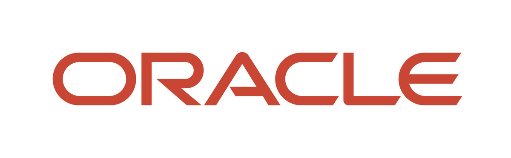
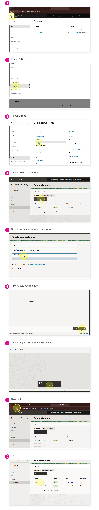
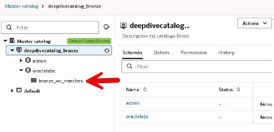
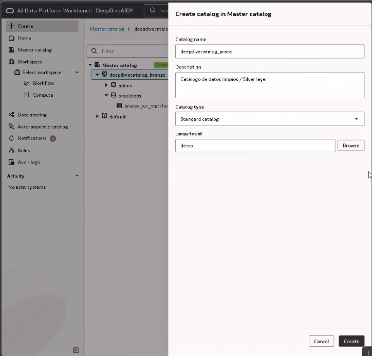
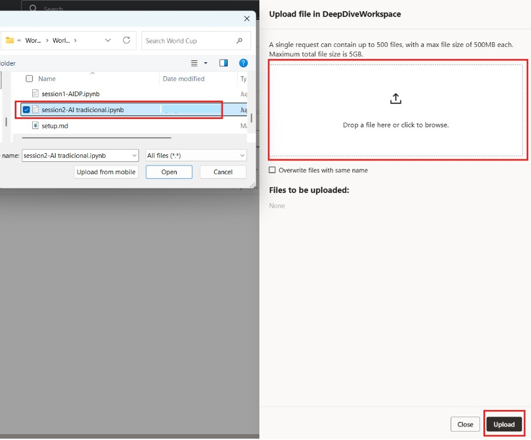
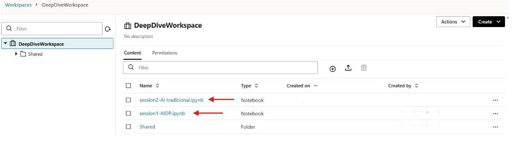

<div align="center">



# 🚀 DeepDive Workshop OCI 2026
### AI Data Platform (AIDP) + AI Database Agent Factory

[](https://cloud.oracle.com/)
[](https://www.oracle.com/database/)
[](https://www.oracle.com/artificial-intelligence/generative-ai/)
[](https://www.oracle.com/ai-data-platform/)
[]()

*Un workshop end‑to‑end para construir una plataforma de datos moderna e inteligente sobre Oracle Cloud Infrastructure, integrando **AI Data Platform** y **AI Database Private Agent Factory**.*

</div>

---

## 📖 Acerca de este workshop

En este laboratorio vas a recorrer el ciclo completo de una **plataforma de datos con IA generativa** sobre Oracle Cloud Infrastructure. Aprovisionarás los servicios, ingestarás datos, organizarás catálogos en arquitectura medallón (Bronze/Silver/Gold) y, finalmente, construirás **agentes de IA** capaces de entender lenguaje natural, generar SQL y narrar resultados — todo sobre productos nativos de Oracle.

Trabajaremos con dos productos estrella del stack de IA de Oracle:

| Producto | Descripción |
|---|---|
| 🧩 **Oracle AI Data Platform (AIDP)** | Plataforma unificada para ingesta, catalogación, workflows de datos, notebooks y agentes inteligentes. |
| 🤖 **Oracle AI Database Private Agent Factory (DPAF)** | Factoría de agentes privados desplegada en tu tenancy, con Agent Builder visual, RAG y Text‑to‑SQL sobre Oracle Database 26ai. |

> 💡 **Pre‑requisito:** acceso activo a una consola de **Oracle Cloud Infrastructure** con permisos en el compartment donde se desplegarán los servicios.

---

## 🎯 Objetivos de aprendizaje

Al finalizar, serás capaz de:

- Aprovisionar una **Autonomous AI Database 26ai** y una instancia de **AI Data Platform** desde cero.
- Ingestar datos en Autonomous mediante `DBMS_CLOUD` y en AIDP mediante catálogos externos y estándar.
- Organizar información siguiendo la arquitectura medallón (**Bronze → Silver → Gold**).
- Ejecutar notebooks de laboratorio en un **cluster de AIDP**.
- Desplegar **AI Database Private Agent Factory** desde OCI Marketplace.
- Construir un **Data Analysis Agent** para Text‑to‑SQL sin escribir código.
- Diseñar un flujo conversacional en **Agent Builder** conectado a una base de datos real.

---

## 🗺️ Arquitectura de la solución

```
                         ┌──────────────────────────┐
                         │   Oracle Cloud Console   │
                         │           (OCI)          │
                         └────────────┬─────────────┘
                                      │ aprovisiona
                                      ▼
                     ┌───────────────────────────────┐
                     │   Autonomous AI Database 26ai │
                     │    (fuente de datos común)    │
                     └──────┬─────────────────┬──────┘
                   Wallet   │                 │   Wallet
                ┌───────────┘                 └────────────┐
                ▼                                           ▼
 ┌──────────────────────────────┐           ┌──────────────────────────────────┐
 │  AI Data Platform (AIDP)     │           │           VCN (Módulo 3)         │
 │  • Catálogos Bronze/Silver/  │           │  Security List / NSG             │
 │    Gold                      │           │  • Ingress TCP 8080              │
 │  • Workspace · Notebooks     │           │    (desde IP autorizada)         │
 │  • Workflows                 │           │            │                      │
 └──────────────────────────────┘           │            ▼                      │
         Módulos 1 y 2                      │  AI Database Private Agent        │
                                            │  Factory (DPAF)                   │
                                            │  • Data Source                    │
                                            │  • Data Analysis Agents           │
                                            │  • Agent Builder · Text-to-SQL    │
                                            └──────────────────────────────────┘

         ※ AIDP y DPAF operan de forma independiente. Ambos consumen la misma
           Autonomous AI Database; DPAF requiere VCN con puerto TCP 8080 abierto.
```

---

## 🧭 Tabla de contenidos

### 🧱 Módulo 1 · Preparación del entorno
- [1.1 Creación del compartment `demo`](#11-creación-del-compartment-demo)
- [1.2 Creación de la Autonomous AI Database](#12-creación-de-la-autonomous-ai-database)
- [1.3 Descarga de la Wallet](#13-descarga-de-la-wallet)
- [1.4 Creación de la AI Data Platform](#14-creación-de-la-ai-data-platform)

### 📥 Módulo 2 · Ingesta y catalogación de datos
- [2.1 Ingesta en Autonomous AI Database](#21-ingesta-en-autonomous-ai-database)
- [2.2 Ingesta vía AIDP](#22-ingesta-vía-aidp)
- [2.3 Creación de catálogos (Bronze / Silver / Gold)](#23-creación-de-catálogos-bronze--silver--gold)
- [2.4 Importación de notebooks al workspace](#24-importación-de-notebooks-al-workspace)
- [2.5 Creación y asociación del cluster](#25-creación-y-asociación-del-cluster)

### 🤖 Módulo 3 · AI Database Private Agent Factory
- [3.1 Creación de la red (VCN)](#31-creación-de-la-red-vcn)
- [3.2 Despliegue desde OCI Marketplace](#32-despliegue-desde-oci-marketplace)
- [3.3 Registro inicial y configuración de modelos](#33-registro-inicial-y-configuración-de-modelos)
- [3.4 Navegación por la plataforma](#34-navegación-por-la-plataforma)
- [3.5 Lab · Data Analysis Agent (Text‑to‑SQL)](#35-lab--data-analysis-agent-text-to-sql)
- [3.6 Lab · Agent Builder — Narrador futbolístico](#36-lab--agent-builder--narrador-futbolístico)

### 🛠️ Soporte
- [Troubleshooting de notebooks y catálogo externo](./TROUBLESHOOTING.md)

---

<div align="center">

# 🧱 Módulo 1 · Preparación del entorno

*En este módulo preparamos el entorno base: creamos un compartment dedicado, una Autonomous AI Database 26ai y una instancia de AI Data Platform.*

</div>

---

### 1.1 Creación del compartment `demo`

Abre el menú de hamburguesa y navega a **Identity & Security → Compartments**.

En la parte izquierda selecciona el compartimento raíz de tu tenancy y haz clic en **Create Compartment**.

Completa el formulario con estos valores:

| Campo | Valor |
|---|---|
| **Name** | `demo` |
| **Description** | `Compartment para DeepDive Workshop OCI 2026` |
| **Parent Compartment** | *Root compartment de tu tenancy* |

Haz clic en **Create Compartment** y espera a que el estado aparezca como **Active**.

- <details>
  <summary>🔽 Haz clic aquí: si tienes problemas para crear el compartment, revisa el paso a paso.</summary>

  1. Ve a **Identity & Security → Compartments**.
  2. Verifica que estás en el **Root compartment** de tu tenancy.
  3. Haz clic en **Create Compartment** y completa `Name = demo`.
  4. Si no aparece el botón o recibes error de permisos, solicita a un administrador acceso IAM para administrar compartments.

  
  </details>

---

### 1.2 Creación de la Autonomous AI Database

Abre el menú de hamburguesa (parte superior izquierda) para acceder a los servicios de OCI. Busca **Oracle AI Database → Autonomous AI Database** y abre el servicio.

<p align="center"></p>

Verifica que estés en el **compartment** correcto y haz clic en **Create Autonomous AI Database**.

<p align="center"></p>
<p align="center"></p>

Completa los campos de configuración:

| Campo | Valor |
|---|---|
| **Display name** | `DeepDiveAutonomousDatabase` |
| **Database name** | `DeepDiveAutonomousDatabase` |
| **Workload type** | `Transaction Processing` |
| **Database version** | `26ai` ⚠️ *Muchas capacidades de IA requieren 23ai o superior* |
| **ECPU Count** | `4` *(recomendado > 2)* |
| **Storage** | `256 GB` |
| **Access type** | `Secure Access from Everywhere` |

<p align="center"></p>

En la sección de **credenciales** crea una contraseña para el usuario `ADMIN`:

> 🔐 **Requisitos de contraseña**
> - Entre 12 y 30 caracteres
> - Al menos una mayúscula y un número
> - Sin comillas simples ni dobles, sin contener el nombre de usuario

<p align="center"></p>

Deja el resto de la configuración por defecto. La base pasará a estado **Provisioning**.

<p align="center"></p>
<p align="center"></p>

---

### 1.3 Descarga de la Wallet

Dentro de la página de la base, junto a **Database Actions**, encontrarás el botón de **Database Connection**.

<p align="center"></p>

Desde ahí descarga la **Wallet**.

<p align="center"></p>

> 🔑 Ingresa una contraseña para proteger la Wallet (puede ser la misma que la de ADMIN). Se descargará un archivo `.zip` que usaremos más adelante.

---

### 1.4 Creación de la AI Data Platform

Abre el menú lateral y navega a **Analytics & AI → AI Data Platform Workbench**.

<p align="center"></p>

Confirma el compartment y haz clic en **Create**.

<p align="center"></p>

Completa:

| Campo | Valor |
|---|---|
| **AIDP name** | `DeepDiveAIDP` |
| **Workspace name** | `DeepDiveWorkspace` |
| **Security policy** | `Standard` |

<p align="center"></p>
<p align="center"></p>

Presiona **Add** y luego **Create**. Serás redirigido al listado con tu AIDP en estado **Creating**.

<p align="center"></p>

---

<div align="center">

# 📥 Módulo 2 · Ingesta y catalogación de datos

*Trabajaremos con una arquitectura medallón: **Bronze** (datos crudos) → **Silver** (limpios) → **Gold** (listos para consumo).*

</div>

---

### 2.1 Ingesta en Autonomous AI Database

Abre tu instancia activa de Autonomous.

<p align="center"></p>
<p align="center"></p>

Entra a **Database Actions → SQL** para abrir el workspace SQL.

<p align="center"></p>

#### Paso 1 · Ejecutar script integral de ingesta (una sola corrida)

Ejecuta como `ADMIN` el script:

[sqltools_oracle_schema_setup.sql](./tools/sqltools_oracle_schema_setup.sql)

Este script deja todo listo en una ejecución:

- Crea el usuario `ORACLELABS`.
- Crea y carga `ORACLELABS.BRONZE_WC_MATCHES`.
- Refresca `ADMIN.BRONZE_WC_MATCHES` para compatibilidad.
- Habilita ORDS/REST para el esquema `ORACLELABS`.

<details>
  <summary> 👇👇Ver SQL (clic para desplegar)👇👇</summary>

  ```sql
-- ================================================================
-- ================================================================
-- DeepDive Workshop OCI 2026
-- SQL Tools Script: schema ORACLELABS + ADMIN compatibility
-- Execute as ADMIN in Database Actions -> SQL
-- ================================================================
SET SERVEROUTPUT ON;

-- 0) Create ORACLELABS user (idempotent)
DECLARE
  v_exists NUMBER := 0;
BEGIN
  SELECT COUNT(*) INTO v_exists FROM dba_users WHERE username = 'ORACLELABS';

  IF v_exists = 0 THEN
    EXECUTE IMMEDIATE 'CREATE USER ORACLELABS IDENTIFIED BY "Welcome123456$"';
    EXECUTE IMMEDIATE 'ALTER USER ORACLELABS QUOTA UNLIMITED ON DATA';
  END IF;
END;
/

-- 1) Base grants
BEGIN
  EXECUTE IMMEDIATE 'GRANT CREATE SESSION TO ORACLELABS';
  EXECUTE IMMEDIATE 'GRANT CREATE TABLE TO ORACLELABS';
  EXECUTE IMMEDIATE 'GRANT CREATE VIEW TO ORACLELABS';
  EXECUTE IMMEDIATE 'GRANT CREATE SEQUENCE TO ORACLELABS';
EXCEPTION
  WHEN OTHERS THEN
    IF SQLCODE != -1927 THEN
      RAISE;
    END IF;
END;
/


BEGIN
  EXECUTE IMMEDIATE 'GRANT EXECUTE ON DBMS_CLOUD TO ORACLELABS';
EXCEPTION
  WHEN OTHERS THEN
    NULL;
END;
/

-- 3) Create table in ORACLELABS
BEGIN
  EXECUTE IMMEDIATE q'[
    CREATE TABLE ORACLELABS.BRONZE_WC_MATCHES (
      key_id NUMBER,
      tournament_id VARCHAR2(50),
      tournament_name VARCHAR2(200),
      match_id VARCHAR2(100),
      match_name VARCHAR2(200),
      stage_name VARCHAR2(100),
      group_name VARCHAR2(100),
      group_stage NUMBER,
      knockout_stage NUMBER,
      replayed NUMBER,
      replay NUMBER,
      match_date VARCHAR2(50),
      match_time VARCHAR2(50),
      stadium_id VARCHAR2(50),
      stadium_name VARCHAR2(200),
      city_name VARCHAR2(100),
      country_name VARCHAR2(100),
      home_team_id VARCHAR2(50),
      home_team_name VARCHAR2(100),
      home_team_code VARCHAR2(10),
      away_team_id VARCHAR2(50),
      away_team_name VARCHAR2(100),
      away_team_code VARCHAR2(10),
      score VARCHAR2(20),
      home_team_score NUMBER,
      away_team_score NUMBER,
      home_team_score_margin NUMBER,
      away_team_score_margin NUMBER,
      extra_time NUMBER,
      penalty_shootout NUMBER,
      score_penalties VARCHAR2(20),
      home_team_score_penalties NUMBER,
      away_team_score_penalties NUMBER,
      result VARCHAR2(50),
      home_team_win NUMBER,
      away_team_win NUMBER,
      draw NUMBER
    )
  ]';
EXCEPTION
  WHEN OTHERS THEN
    IF SQLCODE != -955 THEN
      RAISE;
    END IF;
END;
/

-- 4) Load CSV into ORACLELABS
BEGIN
  EXECUTE IMMEDIATE 'ALTER SESSION SET CURRENT_SCHEMA = ORACLELABS';
  EXECUTE IMMEDIATE 'TRUNCATE TABLE BRONZE_WC_MATCHES';

  DBMS_CLOUD.COPY_DATA(
    table_name      => 'BRONZE_WC_MATCHES',
    credential_name => NULL,
    file_uri_list   => 'https://objectstorage.us-chicago-1.oraclecloud.com/n/axzegnybkron/b/DeepDiveWorkshopData/o/worldcup_matches.csv',
    format          => json_object(
      'type' VALUE 'CSV',
      'skipheaders' VALUE '1'
    )
  );

  EXECUTE IMMEDIATE 'ALTER SESSION SET CURRENT_SCHEMA = ADMIN';
EXCEPTION
  WHEN OTHERS THEN
    EXECUTE IMMEDIATE 'ALTER SESSION SET CURRENT_SCHEMA = ADMIN';
    RAISE;
END;
/
COMMIT;

-- 5) Refresh ADMIN table from ORACLELABS
BEGIN
  EXECUTE IMMEDIATE 'DROP TABLE ADMIN.BRONZE_WC_MATCHES PURGE';
EXCEPTION
  WHEN OTHERS THEN
    IF SQLCODE != -942 THEN
      RAISE;
    END IF;
END;
/

CREATE TABLE ADMIN.BRONZE_WC_MATCHES AS
SELECT *
FROM ORACLELABS.BRONZE_WC_MATCHES;

COMMIT;

-- 6) Enable ORDS REST for ORACLELABS
BEGIN
  ORDS.ENABLE_SCHEMA(
    p_enabled             => TRUE,
    p_schema              => 'ORACLELABS',
    p_url_mapping_type    => 'BASE_PATH',
    p_url_mapping_pattern => 'oraclelabs',
    p_auto_rest_auth      => FALSE
  );
EXCEPTION
  WHEN OTHERS THEN
    NULL;
END;
/

BEGIN
  ORDS.ENABLE_OBJECT(
    p_enabled        => TRUE,
    p_schema         => 'ORACLELABS',
    p_object         => 'BRONZE_WC_MATCHES',
    p_object_type    => 'TABLE',
    p_object_alias   => 'bronze_wc_matches',
    p_auto_rest_auth => FALSE
  );
EXCEPTION
  WHEN OTHERS THEN
    NULL;
END;
/
COMMIT;

-- 7) Quick validations
SELECT username, account_status
FROM dba_users
WHERE username = 'ORACLELABS';

SELECT COUNT(*) AS total_oraclelabs
FROM ORACLELABS.BRONZE_WC_MATCHES;

SELECT COUNT(*) AS total_admin
FROM ADMIN.BRONZE_WC_MATCHES;

-- 8) Print REST URLs
DECLARE
  l_db_name VARCHAR2(128);
BEGIN
  SELECT LOWER(name) INTO l_db_name FROM v$database;

  DBMS_OUTPUT.PUT_LINE('--- ORDS REST ---');
  DBMS_OUTPUT.PUT_LINE('Base schema URL (estimated):');
  DBMS_OUTPUT.PUT_LINE('https://' || l_db_name || '.adb.us-chicago-1.oraclecloudapps.com/ords/oraclelabs/');
  DBMS_OUTPUT.PUT_LINE('Table resource URL:');
  DBMS_OUTPUT.PUT_LINE('https://' || l_db_name || '.adb.us-chicago-1.oraclecloudapps.com/ords/oraclelabs/bronze_wc_matches/');
  DBMS_OUTPUT.PUT_LINE('If URL does not respond, take Database Actions host and append /ords/oraclelabs/');
END;
/

-- AIDP schema hint
-- Preferred schema in external catalog: ORACLELABS


  ```
  </details>

Antes de ejecutar, selecciona primero el código y luego usa el botón verde **Run Statement** o el botón **Run Script**.

<p align="center"></p>

#### Paso 2 · Validar la ingesta

```sql
SELECT COUNT(*) AS total_oraclelabs FROM ORACLELABS.BRONZE_WC_MATCHES;
SELECT COUNT(*) AS total_admin  FROM ADMIN.BRONZE_WC_MATCHES;
```

<p align="center"></p>

También puedes inspeccionar la tabla desde el panel lateral → clic derecho → **Open**.

<p align="center"></p>
<p align="center"></p>

---

### 2.2 Ingesta vía AIDP

Regresa al servicio **AI Data Platform** y abre tu instancia haciendo clic en el nombre.

<p align="center"></p>
<p align="center"></p>

Esta es la **home** de AIDP: desde el menú lateral accedes a catálogos, workspace, workflows, agentes y más.

<p align="center"></p>

---

### 2.3 Creación de catálogos (Bronze / Silver / Gold)

#### 🟫 Catálogo Bronze — conexión externa a Autonomous

Desde el menú lateral, haz clic en **Create**.

<p align="center"></p>

Completa el formulario:

| Campo | Valor |
|---|---|
| **Catalog name** | `DeepDiveCatalog_Bronze` |
| **Description** | *Descripción del catálogo Bronze* |
| **Catalog type** | `External catalog` |
| **External source type** | `Oracle Autonomous AI Transaction Processing` |
| **External source method** | `Wallet` |
| **Selected file** | `Wallet_ABC.zip` *(la que descargaste en 1.2)* |
| **Service** | `deepdiveautonomousdatabase_high` |
| **Wallet password** | *la contraseña de la Wallet* |
| **Username** | `ADMIN` |

<p align="center"></p>

Usa **Test Connection** antes de crear. Cuando sea exitosa, confirma.

<p align="center"></p>
<p align="center"></p>

Al finalizar verás las tablas existentes en Autonomous con su esquema.

> 💡 Si las tablas no aparecen en el catálogo en el primer intento, actualiza/refresca el catálogo y vuelve a validar.
>
> - <details>
>   <summary>👇👇👇Ver referencia visual para actualizar el catálogo</summary>
>
>   
>   </details>





#### 🥈 Catálogo Silver (Plata) — Standard

| Campo | Valor |
|---|---|
| **Catalog name** | `deepdivecatalog_prata` |
| **Description** | *Catálogo de datos limpios / Silver layer* |
| **Catalog type** | `Standard catalog` |
| **Compartment** | `demo` |

<p align="center"></p>



#### 🥇 Catálogo Gold (Oro) — Standard

| Campo | Valor |
|---|---|
| **Catalog name** | `deepdivecatalog_ouro` |
| **Description** | *Catálogo de datos consumibles / Gold layer* |
| **Catalog type** | `Standard catalog` |
| **Compartment** | `demo` |

<p align="center"></p>

---

### 2.4 Creación del cluster

Es necesario crear una instancia para ejecutar los notebooks, vamos al panel izquierdo y hacemos clic en Compute.

<p align="center"></p>

Y seleccionamos *Create*

<p align="center"></p>


Nombra el cluster como `DeepDiveCluster` y deja la configuración por defecto → **Create**.

<p align="center"></p>

### 2.5 Importación de librerías

Una vez el cluster se encuentre creado, podemos seleccionar el cluster en el panel izquierdo de la plataforma AIDP y hacer click en el panel **Library**.

<p align="center">


<p align="center">


Allí podemos cargar el archivo requirements.txt que se encuentra en

- [Descargar `requirements.txt`](./requirements.txt)

Una vez se haya adjuntado el archivo, se iniciará un proceso de instalación de librerías en dos estados, Resolving e Installed.

<p align="center">


Cuando el estado sea installed, tendrás un entorno completamente configurado y puedes seguir las instrucciones de cada notebook junto con el instructor para ejecutar los laboratorios.

### 2.6 Importación de notebooks al workspace

Accede al **Workspace** desde el menú lateral.

<p align="center"></p>

El workspace incluye una carpeta `Shared` con ejemplos.

Los notebooks de este laboratorio están en la **raíz del repositorio** (al mismo nivel que este `README.md`):

- [Descargar `session1-AIDP-ES.ipynb`](./session1-AIDP-ES.ipynb)
- [Descargar `session2-AI_tradicional-ES.ipynb`](./session2-AI_tradicional-ES.ipynb)
- [Descargar `session3-Agents-ES.ipynb`](./session3-Agents-ES.ipynb)

Después de descargarlos, súbelos al Workspace con el botón **Upload**.

<p align="center"></p>
<p align="center"></p>

Una vez cargado, ábrelo haciendo clic en el nombre del notebook.

<p align="center"></p>

---

### 2.7 Creación y asociación del cluster

Una vez cargados los notebooks, abre específicamente `session1-AIDP-ES.ipynb`. Al abrir ese notebook verás **No cluster attached** en la parte superior. Haz clic en el botón de cluster (arriba a la derecha) → **DeepDiveCluster**.

> 💡 Si al iniciar notebooks aparece un error de esquema/catálogo (por ejemplo `SCHEMA_NOT_FOUND` con `admin`), revisa la guía de [Troubleshooting](./TROUBLESHOOTING.md).

Si no se adjunta automáticamente, usa **Attach a cluster** y selecciona el que creaste.

<p align="center"></p>

El cluster debe quedar **Active** en el notebook:

<p align="center">

&nbsp;&nbsp;


Repite el mismo proceso de upload para el archivo Jupyter de la segunda sesión.
<p align="center">


Con eso tendrás todos los notebooks necesarios para realizar las sesiones prácticas directamente en tu workspace.

<p align="center">



Para ejecutar cada celda del notebook, haz clic en el botón **Play** o usa el atajo **Ctrl + Enter**.
</p>

> ✅ **Checkpoint Módulo 2** — Con los datos cargados, los tres catálogos creados y el cluster activo, el entorno está listo para las sesiones de notebooks y para comenzar con Agent Factory.

---

<div align="center">
