<div align="center">


# 🚀 DeepDive Workshop OCI 2026
### AI Data Platform (AIDP) + AI Database Agent Factory

[](https://cloud.oracle.com/)
[](https://www.oracle.com/database/)
[](https://www.oracle.com/artificial-intelligence/generative-ai/)
[]()
[]()

*Un workshop end‑to‑end para construir una plataforma de datos moderna e inteligente sobre Oracle Cloud Infrastructure, integrando **AI Data Platform** y **AI Database Private Agent Factory**.*

</div>

---

## 📖 Acerca de este workshop

En este laboratorio vas a recorrer el ciclo completo de una **plataforma de datos con IA generativa** sobre Oracle Cloud Infrastructure. Aprovisionarás los servicios, ingestarás datos, organizarás catálogos en arquitectura medallón (Bronze/Silver/Gold) y, finalmente, construirás **agentes de IA** capaces de entender lenguaje natural, generar SQL y narrar resultados — todo sobre productos nativos de Oracle.

Trabajaremos con dos productos estrella del stack de IA de Oracle:

| Producto | Descripción |
|---|---|
| 🧩 **Oracle AI Data Platform (AIDP)** | Plataforma unificada para ingesta, catalogación, workflows de datos, notebooks y agentes inteligentes. |
| 🤖 **Oracle AI Database Private Agent Factory (DPAF)** | Factoría de agentes privados desplegada en tu tenancy, con Agent Builder visual, RAG y Text‑to‑SQL sobre Oracle Database 26ai. |

> 💡 **Pre‑requisito:** acceso activo a una consola de **Oracle Cloud Infrastructure** con permisos en el compartment donde se desplegarán los servicios.

---

## 🎯 Objetivos de aprendizaje

Al finalizar, serás capaz de:

- Aprovisionar una **Autonomous AI Database 26ai** y una instancia de **AI Data Platform** desde cero.
- Ingestar datos en Autonomous mediante `DBMS_CLOUD` y en AIDP mediante catálogos externos y estándar.
- Organizar información siguiendo la arquitectura medallón (**Bronze → Silver → Gold**).
- Ejecutar notebooks de laboratorio en un **cluster de AIDP**.
- Desplegar **AI Database Private Agent Factory** desde OCI Marketplace.
- Construir un **Data Analysis Agent** para Text‑to‑SQL sin escribir código.
- Diseñar un flujo conversacional en **Agent Builder** conectado a una base de datos real.

---

## 🗺️ Arquitectura de la solución

```
                        ┌──────────────────────────┐
                        │   Oracle Cloud Console   │
                        │           (OCI)          │
                        └────────────┬─────────────┘
                                     │ aprovisiona
                                     ▼
                     ┌──────────────────────────────┐
                     │   Autonomous AI Database 26ai │
                     │   (fuente de datos común)     │
                     └──────┬────────────────┬──────┘
                   Wallet   │                │   Wallet
               ┌────────────┘                └────────────┐
               ▼                                          ▼
 ┌──────────────────────────────┐        ┌──────────────────────────────┐
 │  AI Data Platform (AIDP)     │        │  AI Database Private Agent   │
 │                              │        │  Factory (DPAF)              │
 │  • Catálogos Bronze/Silver/  │        │  • Data Source               │
 │    Gold                      │        │  • Data Analysis Agents      │
 │  • Workspace · Notebooks     │        │  • Agent Builder (visual)    │
 │  • Workflows                 │        │  • Text-to-SQL · RAG         │
 └──────────────────────────────┘        └──────────────────────────────┘
          Módulos 1 y 2                           Módulo 3

        ※ AIDP y DPAF operan de forma independiente. Ambos consumen
           la misma Autonomous AI Database, pero no se comunican entre sí.
```

---

## 🧭 Tabla de contenidos

### 🧱 Módulo 1 · Preparación del entorno
- [1.1 Creación de la Autonomous AI Database](#11-creación-de-la-autonomous-ai-database)
- [1.2 Descarga de la Wallet](#12-descarga-de-la-wallet)
- [1.3 Creación de la AI Data Platform](#13-creación-de-la-ai-data-platform)

### 📥 Módulo 2 · Ingesta y catalogación de datos
- [2.1 Ingesta en Autonomous AI Database](#21-ingesta-en-autonomous-ai-database)
- [2.2 Ingesta vía AIDP](#22-ingesta-vía-aidp)
- [2.3 Creación de catálogos (Bronze / Silver / Gold)](#23-creación-de-catálogos-bronze--silver--gold)
- [2.4 Importación de notebooks al workspace](#24-importación-de-notebooks-al-workspace)
- [2.5 Creación y asociación del cluster](#25-creación-y-asociación-del-cluster)

### 🤖 Módulo 3 · AI Database Private Agent Factory
- [3.1 Creación de la red (VCN)](#31-creación-de-la-red-vcn)
- [3.2 Despliegue desde OCI Marketplace](#32-despliegue-desde-oci-marketplace)
- [3.3 Registro inicial y configuración de modelos](#33-registro-inicial-y-configuración-de-modelos)
- [3.4 Navegación por la plataforma](#34-navegación-por-la-plataforma)
- [3.5 Lab · Data Analysis Agent (Text‑to‑SQL)](#35-lab--data-analysis-agent-text-to-sql)
- [3.6 Lab · Agent Builder — Narrador futbolístico](#36-lab--agent-builder--narrador-futbolístico)

---

<div align="center">

# 🧱 Módulo 1 · Preparación del entorno

*En este módulo inicializamos los servicios base: una Autonomous AI Database 26ai y una instancia de AI Data Platform.*

</div>

---

### 1.1 Creación de la Autonomous AI Database

Abre el menú de hamburguesa (parte superior izquierda) para acceder a los servicios de OCI. Busca **Oracle AI Database → Autonomous AI Database** y abre el servicio.

<p align="center"></p>

Verifica que estés en el **compartment** correcto y haz clic en **Create Autonomous AI Database**.

<p align="center"></p>
<p align="center"></p>

Completa los campos de configuración:

| Campo | Valor |
|---|---|
| **Display name** | `DeepDiveAutonomousDatabase` |
| **Database name** | `DeepDiveAutonomousDatabase` |
| **Workload type** | `Transaction Processing` |
| **Database version** | `26ai` ⚠️ *Muchas capacidades de IA requieren 23ai o superior* |
| **ECPU Count** | `4` *(recomendado > 2)* |
| **Storage** | `256 GB` |
| **Access type** | `Secure Access from Everywhere` |

<p align="center"></p>

En la sección de **credenciales** crea una contraseña para el usuario `ADMIN`:

> 🔐 **Requisitos de contraseña**
> - Entre 12 y 30 caracteres
> - Al menos una mayúscula y un número
> - Sin comillas simples ni dobles, sin contener el nombre de usuario

<p align="center"></p>

Deja el resto de la configuración por defecto. La base pasará a estado **Provisioning**.

<p align="center"></p>
<p align="center"></p>

---

### 1.2 Descarga de la Wallet

Dentro de la página de la base, junto a **Database Actions**, encontrarás el botón de **Database Connection**.

<p align="center"></p>

Desde ahí descarga la **Wallet**.

<p align="center"></p>

> 🔑 Ingresa una contraseña para proteger la Wallet (puede ser la misma que la de ADMIN). Se descargará un archivo `.zip` que usaremos más adelante.

---

### 1.3 Creación de la AI Data Platform

Abre el menú lateral y navega a **Analytics & AI → AI Data Platform Workbench**.

<p align="center"></p>

Confirma el compartment y haz clic en **Create**.

<p align="center"></p>

Completa:

| Campo | Valor |
|---|---|
| **AIDP name** | `DeepDiveAIDP` |
| **Workspace name** | `DeepDiveWorkspace` |
| **Security policy** | `Standard` |

<p align="center"></p>
<p align="center"></p>

Presiona **Add** y luego **Create**. Serás redirigido al listado con tu AIDP en estado **Creating**.

<p align="center"></p>

---

<div align="center">

# 📥 Módulo 2 · Ingesta y catalogación de datos

*Trabajaremos con una arquitectura medallón: **Bronze** (datos crudos) → **Silver** (limpios) → **Gold** (listos para consumo).*

</div>

---

### 2.1 Ingesta en Autonomous AI Database

Abre tu instancia activa de Autonomous.

<p align="center"></p>
<p align="center"></p>

Entra a **Database Actions → SQL** para abrir el workspace SQL.

<p align="center"></p>

#### Paso 1 · Crear la tabla Bronze

```sql
CREATE TABLE BRONZE_WC_MATCHES (
    key_id NUMBER,
    tournament_id VARCHAR2(50),
    tournament_name VARCHAR2(200),
    match_id VARCHAR2(100),
    match_name VARCHAR2(200),
    stage_name VARCHAR2(100),
    group_name VARCHAR2(100),
    group_stage NUMBER,
    knockout_stage NUMBER,
    replayed NUMBER,
    replay NUMBER,
    match_date VARCHAR2(50),
    match_time VARCHAR2(50),
    stadium_id VARCHAR2(50),
    stadium_name VARCHAR2(200),
    city_name VARCHAR2(100),
    country_name VARCHAR2(100),
    home_team_id VARCHAR2(50),
    home_team_name VARCHAR2(100),
    home_team_code VARCHAR2(10),
    away_team_id VARCHAR2(50),
    away_team_name VARCHAR2(100),
    away_team_code VARCHAR2(10),
    score VARCHAR2(20),
    home_team_score NUMBER,
    away_team_score NUMBER,
    home_team_score_margin NUMBER,
    away_team_score_margin NUMBER,
    extra_time NUMBER,
    penalty_shootout NUMBER,
    score_penalties VARCHAR2(20),
    home_team_score_penalties NUMBER,
    away_team_score_penalties NUMBER,
    result VARCHAR2(50),
    home_team_win NUMBER,
    away_team_win NUMBER,
    draw NUMBER
);
```

Ejecuta con el botón verde **Run Statement**.

<p align="center"></p>

#### Paso 2 · Cargar datos desde Object Storage

```sql
BEGIN
  DBMS_CLOUD.COPY_DATA(
    table_name      => 'BRONZE_WC_MATCHES',
    credential_name => NULL,
    file_uri_list   => 'https://objectstorage.us-chicago-1.oraclecloud.com/n/axzegnybkron/b/DeepDiveWorkshopData/o/worldcup_matches.csv',
    format          => json_object(
      'type' value 'CSV',
      'skipheaders' value '1'
    )
  );
END;
```

#### Paso 3 · Validar la ingesta

```sql
SELECT * FROM BRONZE_WC_MATCHES;
```

<p align="center"></p>

También puedes inspeccionar la tabla desde el panel lateral → clic derecho → **Open**.

<p align="center"></p>
<p align="center"></p>

---

### 2.2 Ingesta vía AIDP

Regresa al servicio **AI Data Platform** y abre tu instancia haciendo clic en el nombre.

<p align="center"></p>
<p align="center"></p>

Esta es la **home** de AIDP: desde el menú lateral accedes a catálogos, workspace, workflows, agentes y más.

<p align="center"></p>

---

### 2.3 Creación de catálogos (Bronze / Silver / Gold)

#### 🟫 Catálogo Bronze — conexión externa a Autonomous

Desde el menú lateral, haz clic en **Create**.

<p align="center"></p>

Completa el formulario:

| Campo | Valor |
|---|---|
| **Catalog name** | `DeepDiveCatalog_Bronze` |
| **Description** | *Descripción del catálogo Bronze* |
| **Catalog type** | `External catalog` |
| **External source type** | `Oracle Autonomous AI Transaction Processing` |
| **External source method** | `Wallet` |
| **Selected file** | `Wallet_ABC.zip` *(la que descargaste en 1.2)* |
| **Service** | `deepdiveautonomousdatabase_high` |
| **Wallet password** | *la contraseña de la Wallet* |
| **Username** | `ADMIN` |

<p align="center"></p>

Usa **Test Connection** antes de crear. Cuando sea exitosa, confirma.

<p align="center"></p>
<p align="center"></p>

Al finalizar verás las tablas existentes en Autonomous con su esquema.

<p align="center"></p>

#### 🥈 Catálogo Silver (Plata) — Standard

| Campo | Valor |
|---|---|
| **Catalog name** | `deepdivecatalog_prata` |
| **Description** | *Catálogo de datos limpios / Silver layer* |
| **Catalog type** | `Standard catalog` |

<p align="center"></p>

#### 🥇 Catálogo Gold (Oro) — Standard

| Campo | Valor |
|---|---|
| **Catalog name** | `deepdivecatalog_ouro` |
| **Description** | *Catálogo de datos consumibles / Gold layer* |
| **Catalog type** | `Standard catalog` |

<p align="center"></p>

---

### 2.4 Importación de notebooks al workspace

Accede al **Workspace** desde el menú lateral.

<p align="center"></p>

El workspace incluye una carpeta `Shared` con ejemplos. Descarga los notebooks del repo (`session1-AIDP-ES.ipynb` y `session2-AI_tradicional-ES.ipynb`) y súbelos con el botón **Upload**.

<p align="center"></p>
<p align="center"></p>

Una vez cargado, ábrelo haciendo clic en el nombre del notebook.

<p align="center"></p>

---

### 2.5 Creación y asociación del cluster

Al abrir el notebook verás **No cluster attached** en la parte superior. Haz clic en el botón de cluster (arriba a la derecha) → **Create Cluster**.

<p align="center"></p>

Nombra el cluster como `DeepDiveCluster` y deja la configuración por defecto → **Create**.

<p align="center"></p>

Si no se adjunta automáticamente, usa **Attach a cluster** y selecciona el que creaste.

<p align="center"></p>

El cluster debe quedar **Active** en el notebook:

<p align="center">

&nbsp;&nbsp;

</p>

> ✅ **Checkpoint Módulo 2** — Con los datos cargados, los tres catálogos creados y el cluster activo, el entorno está listo para las sesiones de notebooks y para comenzar con Agent Factory.

---

<div align="center">

# 🤖 Módulo 3 · AI Database Private Agent Factory

*Aprovisionamos desde Marketplace una factoría privada de agentes sobre Oracle Database 26ai, la integramos con nuestra Autonomous y construimos agentes Text‑to‑SQL y flujos conversacionales.*

</div>

---

### 3.1 Creación de la red (VCN)

Navega a **Networking → Virtual Cloud Networks** y confirma el compartment.

<p align="center"></p>

Crea una VCN **con acceso a internet**:

<p align="center"></p>

| Campo | Valor |
|---|---|
| **Name** | `vcn-agent` |

El resto de valores por defecto → **Next → Create**.

#### 🔐 Configuración de puertos

Una vez creada la VCN, en el panel **Security** abre **Security Lists** y selecciona la lista por defecto (`Default Security List for …`).

<p align="center"></p>
<p align="center"></p>

En **Security Rules → Add Ingress Rules** añade:

<p align="center"></p>
<p align="center"></p>
<p align="center"></p>

| Source CIDR | Destination Port Range | Propósito |
|---|---|---|
| `0.0.0.0/0` | `8080` | Interfaz web de DPAF |
| `0.0.0.0/0` | `1521` | Conexión a Oracle Database |

<p align="center"></p>
<p align="center"></p>

Confirma con **Add Ingress Rules**.

---

### 3.2 Despliegue desde OCI Marketplace

🔗 [Oracle AI Database Private Agent Factory · Marketplace Listing](https://marketplace.oracle.com/listings/oracle-ai-database-private-agent-factory/ocid1.mktpublisting.oc1.iad.amaaaaaaknuwtjiawz3nex7vjo2usqfv3jr5v6scz5uzvg7mef6ykxuc5zaa)

Navega a **Marketplace → All Applications** y busca la aplicación:

<p align="center"></p>

```
Oracle AI Database Private Agent Factory
```

<p align="center"></p>
<p align="center"></p>

Selecciona la app → **Launch Stack**. Confirma el compartment.

<p align="center"></p>

#### 1️⃣ Stack information

Nombre y descripción del stack (puedes dejar la descripción por defecto).

#### 2️⃣ Configure variables

**General settings**
```yaml
Region:             us-chicago-1
VM compartment:     <tu compartment>
Subnet compartment: <tu compartment>
```

**Network Configuration**
```yaml
VCN:                    vcn-agent
Existing subnet:        <subred pública>
Public or Private:      public
```

**Agent Factory VM**
```yaml
Agent Factory server display name: AgentFactoryVM
Agent Factory server shape:        VM.Standard.E5.Flex
```

<p align="center">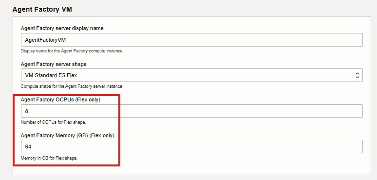</p>

**Public SSH key**

> 🔑 Se requiere una llave pública SSH. Si no tienes una, puedes generarla con PowerShell:
> ```powershell
> ssh-keygen -t rsa -b 4096 -f .\oraclelabs
> ```
> Carga la llave **pública** (`.pub`). Windows puede confundir la extensión con Microsoft Publisher.

<p align="center"></p>

#### 3️⃣ Review

Revisa la configuración y lanza el stack. El proceso toma **3–4 minutos**. Cuando finaliza, el último log muestra un **link de acceso** a DPAF.

---

### 3.3 Registro inicial y configuración de modelos

Abre el link entregado por el stack. Verás la página de **registro inicial**:

<p align="center"></p>

Registra tu cuenta y continúa a la **conexión con la base de datos**, cargando la Wallet que descargaste en el paso **1.2**.

<p align="center"></p>

| Campo | Valor |
|---|---|
| **Air‑gapped environment** | `No` |
| **Does the database server use a wallet?** | `Yes` |
| **Are the OCI certificates added to the wallet?** | `Yes` |

Prueba la conexión; un mensaje de éxito confirma la comunicación con la base.

<p align="center"></p>

Al presionar **Next** verás los logs de instalación. En el paso siguiente configuraremos los modelos.

#### Configuración del modelo de lenguaje (LLM)

<p align="center"></p>

```yaml
Model id:       meta.llama-4-maverick-17b-128e-instruct-fp8
Endpoint:       https://inference.generativeai.us-chicago-1.oci.oraclecloud.com
Compartment ID: ocid1.compartment...     # Identity and Security → Compartments
User ID:        ocid1.user.oc1...        # Identity → My profile
```

> 🔎 Puedes usar cualquier modelo disponible en el [OCI Generative AI Playground — Chat](https://cloud.oracle.com/ai-service/generative-ai/playground/chat). Ajusta el endpoint según tu región.

<p align="center"></p>

#### Configuración del modelo de Embeddings

Al hacer scroll encontrarás la opción para agregar un modelo de embeddings.

<p align="center"></p>

Selecciona **OCI Gen AI** y completa:

```yaml
Model id:       cohere.embed-multilingual-image-v3.0
Endpoint:       https://inference.generativeai.us-chicago-1.oci.oraclecloud.com
Compartment ID: ocid1.compartment...
User ID:        ocid1.user.oc1...
```

> 🔎 Lista de modelos disponibles: [OCI Generative AI Playground — Embed](https://cloud.oracle.com/ai-service/generative-ai/playground/embed).

Si las conexiones son exitosas, continúa con la instalación.

<p align="center"></p>
<p align="center"></p>

---

### 3.4 Navegación por la plataforma

Al finalizar, accederás a la **home de DPAF**:

<p align="center"></p>

Ya puedes construir tus propios flujos y agentes de IA.

---

### 3.5 Lab · Data Analysis Agent (Text‑to‑SQL)

> ⚽ **Caso de uso:** construirás un agente de análisis sobre estadísticas de la **Copa Mundial de Fútbol 2022**. El agente entenderá preguntas en lenguaje natural, las traducirá a SQL y devolverá respuestas, tablas y visualizaciones — sin escribir una sola línea de código.

#### Paso 1 · Crear el Data Source

En el panel izquierdo selecciona **Data Source** y crea uno de tipo **Database**:

| Campo | Valor |
|---|---|
| **Name** | *Nombre descriptivo de la conexión* |
| **Description** | *Propósito de la fuente* |
| **Connection type** | *Carga la Wallet descargada en 1.2* |
| **Username** | `ADMIN` |
| **Password** | *la contraseña de tu Autonomous* |

<p align="center">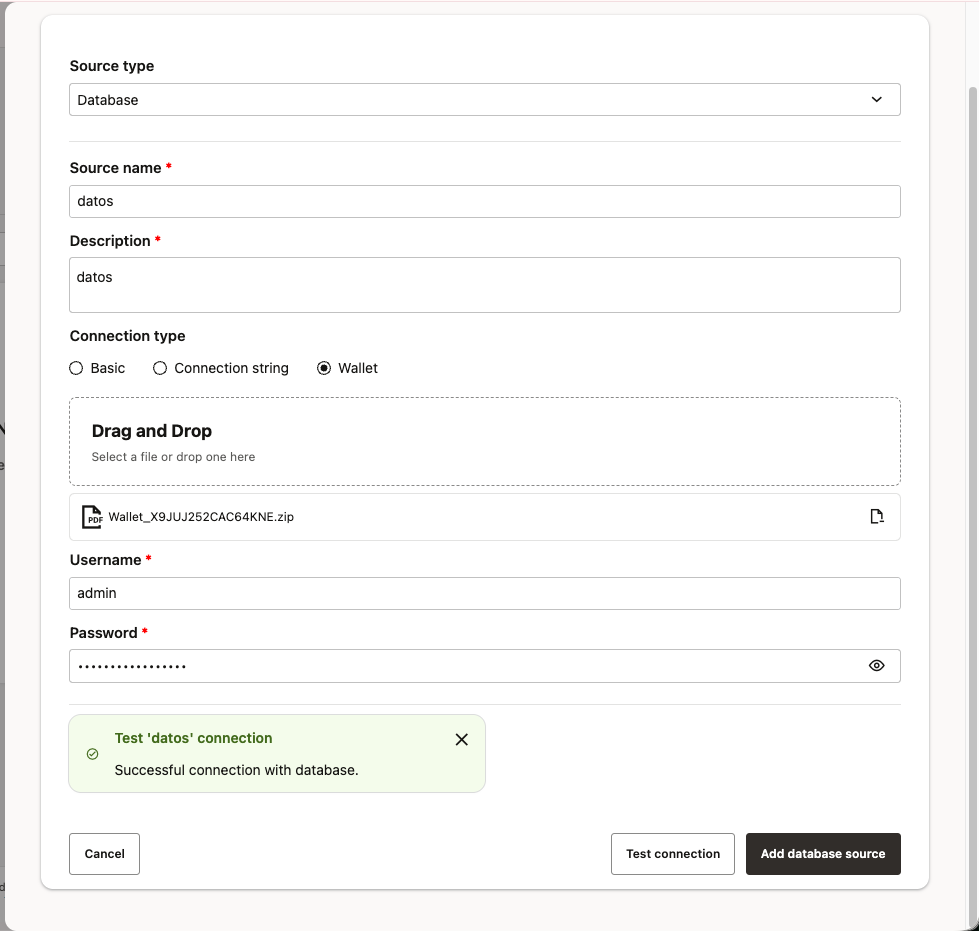</p>

Haz clic en **Test Connection** y luego **Add Database Source**.

> ✅ Al volver al panel **Data Source** verás tu nueva fuente listada.

#### Paso 2 · Crear el Data Analysis Agent

En el menú izquierdo → **Data Analysis Agents → Create Agent**.

<p align="center">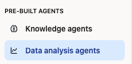</p>
<p align="center">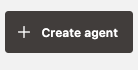</p>

**2.1 Selección de la base de datos** — elige la fuente configurada.

**2.2 Selección de tablas** — usa la barra de búsqueda para encontrar las tablas (el nombre de cada tabla corresponde al archivo CSV cargado, sin la extensión `.csv`).

<p align="center">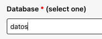</p>
<p align="center">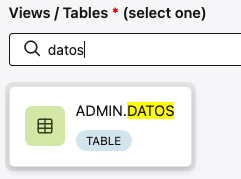</p>

> 💡 **Ejemplo:** si el archivo se llama `datos.csv`, la tabla será `DATOS`.

Confirma con **Add New Source**.

<p align="center">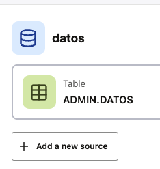</p>

**2.3 Revisión** — valida base y tablas → **Next**.

<p align="center">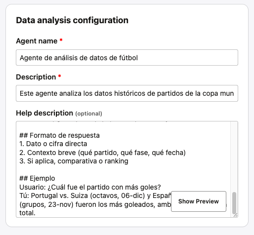</p>
<p align="center">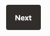</p>

**2.4 Publicación** — **Publish Agent**.

<p align="center">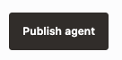</p>

#### Paso 3 · Usar el agente

Abre el agente con **Open Agent**.

<p align="center">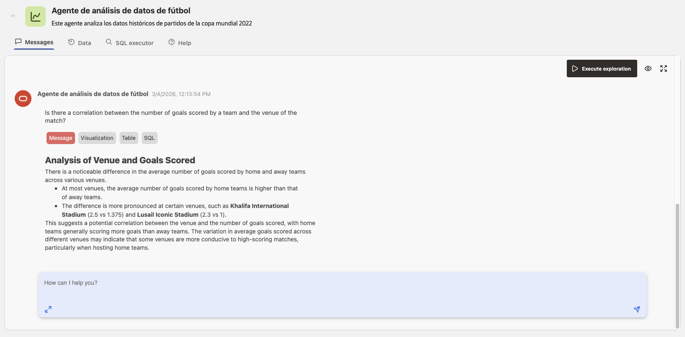</p>

Pulsa **Execute Exploration**: el agente analiza automáticamente los datos y genera visualizaciones según los tipos detectados.

<p align="center">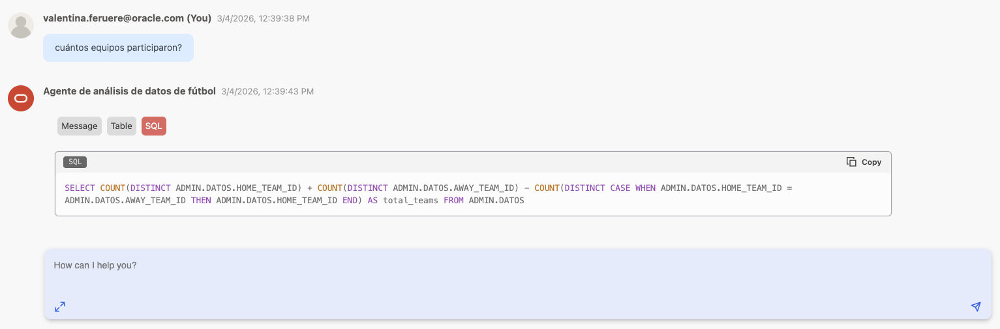</p>

Ahora hazle preguntas en **lenguaje natural**:

> 💬 *"¿Cuántos equipos participaron?"*
> 💬 *"¿Cuál fue el estadio con más goles anotados?"*
> 💬 *"Muestra la distribución de goles por fase del torneo"*

Haz clic en el botón **SQL** para auditar la consulta generada por el agente.

---

### 3.6 Lab · Agent Builder — Narrador futbolístico

Construirás un flujo visual en **Agent Builder** en dos etapas:

1. **Parte 1** — agente narrador simple (4 bloques).
2. **Parte 2** — flujo completo con Text‑to‑SQL sobre la base de datos real.

---

#### ⚽ Parte 1 · Agente narrador futbolístico

Flujo mínimo y funcional con cuatro bloques: `Chat input` → `Prompt` → `Agent` → `Chat output`.

<p align="center"></p>

##### 1.1 · Crear un nuevo flujo

Menú izquierdo → **Agent Builder** → **New Flow**.

<p align="center"></p>

##### 1.2 · Bloque `Chat input`

Sección **INPUTS** → arrastra **Chat input** al lienzo. Expone la variable `Message`.

##### 1.3 · Bloque `Prompt`

Sección **INPUTS** → arrastra **Prompt**. Configura el campo **Template**:

```text
Eres un narrador deportivo experto en fútbol, apasionado y elocuente.
Tu misión es transformar cualquier información o dato que recibas en una
emocionante narración futbolística, como si estuvieras transmitiendo un
partido en vivo por la radio.

No importa si el input es un resultado, una lista de números, un nombre
o cualquier otro dato: conviértelo en una narración dinámica, con emoción
y vocabulario propio del fútbol.
```

> 💡 Sin variables `{{}}`. La salida **Prompt message** se conectará al campo **Custom instructions** del `Agent`.

##### 1.4 · Bloque `Agent`

Sección **AGENTS** → arrastra **Agent** y configura:

| Campo | Valor |
|---|---|
| **Select LLM to use** | `openai.gpt-oss-120b (oci)` |
| **Temperature** | `0.01` |
| **Agent description** | `Agent` |

Conexiones:

- `Prompt.Prompt message` → `Agent.Custom instructions`
- `Chat input.Message` → `Agent.Prompt`

> 💡 La personalidad entra como **instrucción de sistema**, mientras que el mensaje del usuario va al campo **Prompt** del agente.

##### 1.5 · Bloque `Chat output`

Sección **OUTPUTS** → arrastra **Chat output** y conecta `Agent.Message` → `Chat output.Message`.

##### 1.6 · Guardar y probar

**Save** → **Playground**. Prueba con, por ejemplo:

> `3 - 1`
> `Messi, Mbappé, Vinicius`
> `El partido duró 90 minutos y hubo 4 tarjetas amarillas`

<p align="center"></p>

---

#### ⚽ Parte 2 · Flujo completo con Text‑to‑SQL

Extenderemos el flujo para que reciba preguntas, genere SQL, lo ejecute contra la base de datos real y responda como narración futbolística.

<p align="center"></p>

##### 2.1 · Continuar editando el flujo

Seguimos trabajando sobre el flujo de la Parte 1.

##### 2.2 · Primer `Prompt` — generador de SQL

Añade un bloque **Prompt** con este **Template**:

```text
Eres un agente que genera consultas SQL para responder a la siguiente pregunta:

{{question}}

Tienes una tabla de datos de partidos de fútbol con la siguiente estructura.

CREATE TABLE "ADMIN"."DATOS"
 ( "HOME_TEAM_NAME"   VARCHAR2(64),
   "AWAY_TEAM_NAME"   VARCHAR2(64),
   "HOME_TEAM_ID"     NUMBER,
   "AWAY_TEAM_ID"     NUMBER,
   "HOME_TEAM_GOALS"  NUMBER,
   "AWAY_TEAM_GOALS"  NUMBER,
   "DATE_RW"          TIMESTAMP(6) WITH TIME ZONE,
   "REFEREE"          VARCHAR2(64),
   "VENUE_NAME"       VARCHAR2(64),
   "VENUE_CITY"       VARCHAR2(64)
 );

Debes generar únicamente código SQL, sin comentarios (ni `--` ni `/** */`).
Cualquier texto adicional constituye un error grave. No finalices el SQL con `;`.

Ejemplo:
Pregunta: ¿Cuántos partidos se jugaron en Doha?
Respuesta esperada:
SELECT COUNT(*) AS numero_de_partidos_en_doha
FROM "ADMIN"."DATOS"
WHERE VENUE_CITY LIKE '%Doha%'
```

Conecta `Chat input.Message` → `Prompt.question`.

##### 2.3 · Bloque `LLM`

Sección **LANGUAGE MODEL** → añade **LLM**.

| Campo | Valor |
|---|---|
| **Select LLM to use** | `openai.gpt-oss-120b (oci)` |
| **Temperature** | `0.01` |

Conecta `Prompt(SQL generator).Prompt message` → `LLM.Prompt`.

> 💡 Una temperatura muy baja fuerza respuestas deterministas — ideal para SQL.

##### 2.4 · Bloque `SQL query`

Sección **DATA** → añade **SQL query**.

| Campo | Valor |
|---|---|
| **Select database** | `Datos` *(o el nombre de tu fuente)* |
| **Include columns** | ✅ |
| **Query** | *conectado desde `LLM.Message`* |

<p align="center"></p>

##### 2.5 · Segundo `Prompt` — narrador con datos reales

Añade un segundo bloque **Prompt** que combine pregunta + SQL + datos:

```text
Eres un asistente experto en fútbol, con personalidad cercana y entusiasta.
Tu rol es transformar datos crudos en respuestas claras, narrativas y fáciles
de entender, como si le explicaras a un amigo apasionado del fútbol.

El sistema ha ejecutado la consulta:
{{sql}}

Los datos disponibles para responder son:
{{datos}}

Instrucciones:
- Si la pregunta no está relacionada con fútbol, responde amablemente que solo
  puedes ayudar con preguntas sobre fútbol y no continúes procesando la solicitud.
- Responde ÚNICAMENTE con la información contenida en {{datos}} — no uses
  conocimiento externo ni completes con datos que no estén en el resultado.
- Si {{datos}} no contiene suficiente información, dilo claramente.
- Responde en lenguaje natural y conversacional, no listes los datos crudos.
- Incluye siempre una tabla con los datos de {{datos}}, formateada de forma clara.
- Contextualiza el dato: si es un número, explica qué significa.
- Menciona el SQL usado: {{sql}}
- Responde en el mismo idioma en que el usuario hizo la pregunta.
```

Presiona **Save prompt** (crea automáticamente los nodos `{{...}}`) y conecta:

| Variable | Fuente |
|---|---|
| `{{question}}` | `Chat input.Message` |
| `{{sql}}` | `LLM.Message` |
| `{{datos}}` | `SQL query.JSON` |

##### 2.6 · Bloque `Agent`

Conecta `Prompt(narrador).Prompt message` → `Agent.Prompt`.

##### 2.7 · Bloque `Chat output`

Verifica que `Agent.Message` → `Chat output.Message`.

##### 2.8 · Guardar y publicar

**Save** → revisa el diagrama (debe coincidir con el esquema). **Publish** para dejarlo disponible.

<p align="center"></p>

##### 2.9 · Probar el flujo completo

En el **Playground**:

> 💬 `¿Cuántos partidos se jugaron en Doha?`
> 💬 `¿Qué equipo anotó más goles de local?`
> 💬 `¿Cuál fue el partido con más goles en total?`

El agente consultará la base de datos y devolverá la respuesta en formato narrativo, incluyendo tabla de datos y el SQL ejecutado. 🎉

---

## 🏁 ¡Workshop completado!

Has construido, de extremo a extremo, una plataforma de datos moderna con IA generativa sobre Oracle Cloud Infrastructure:

- ✅ Infraestructura: Autonomous AI Database 26ai + AI Data Platform
- ✅ Arquitectura medallón: catálogos Bronze / Silver / Gold
- ✅ Notebooks ejecutados sobre cluster de AIDP
- ✅ Factoría privada de agentes desplegada desde Marketplace
- ✅ Agente **Text‑to‑SQL** sin escribir código
- ✅ Flujo conversacional con **Agent Builder**, integrado con la base de datos real

---

## 🔗 Recursos adicionales

- 📘 [Oracle AI Developer Hub](https://github.com/oracle-devrel/oracle-ai-developer-hub)
- 📙 [Oracle Technology Engineering · AI](https://github.com/oracle-devrel/technology-engineering/tree/main/ai)
- 📗 [OCI AI Industry Database Solutions](https://github.com/oracle-devrel/oci-ai-industry-dbsolutions)
- 🎓 [Oracle University · AI Courses](https://education.oracle.com/artificial-intelligence)
- 📄 [Oracle AI Database Documentation](https://docs.oracle.com/en/database/oracle/oracle-database/)
- 🛒 [Oracle Marketplace](https://cloudmarketplace.oracle.com/)

---

## 🤝 Contribuciones

¿Encontraste una mejora? Abre un **Issue** o un **Pull Request**. El objetivo es que esta guía se mantenga actualizada con las últimas capacidades de la plataforma.

---

<div align="center">

**Oracle Cloud Infrastructure · DeepDive 2026**
*Hecho con ❤️ por el equipo de AI & Data Platform · LAD*

</div>
